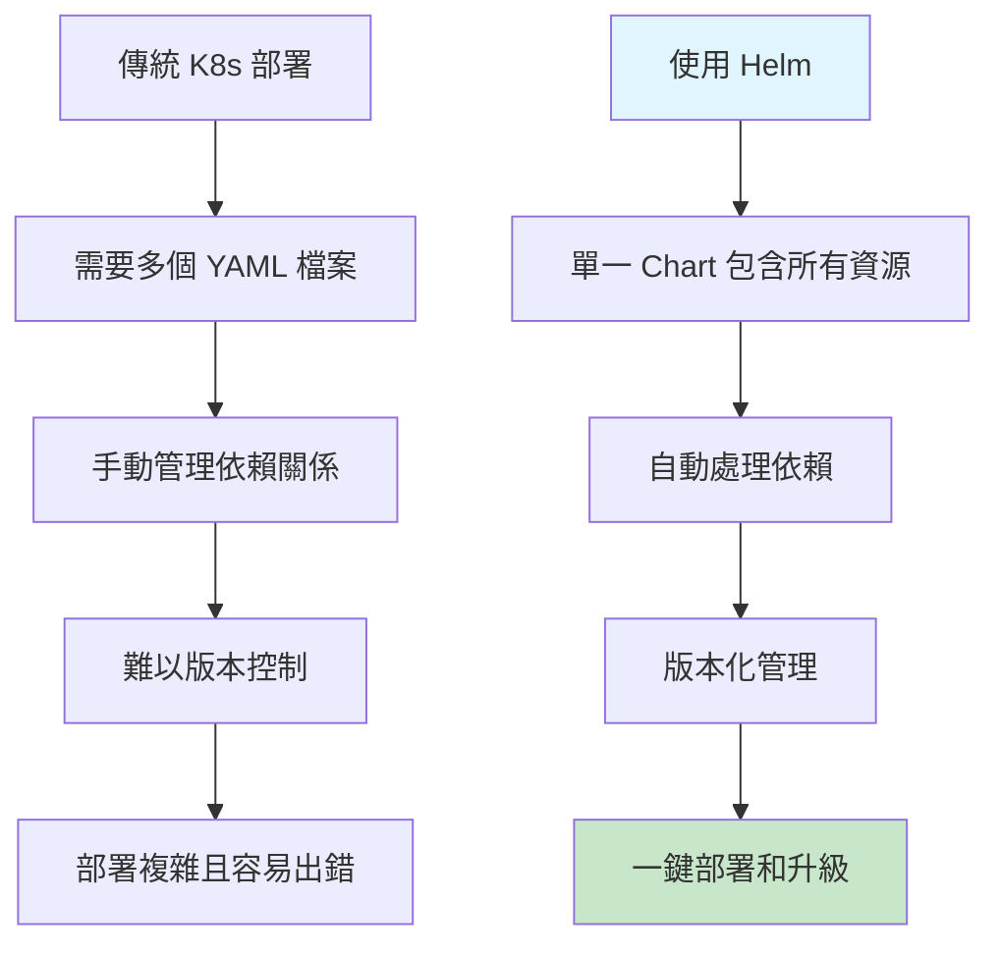
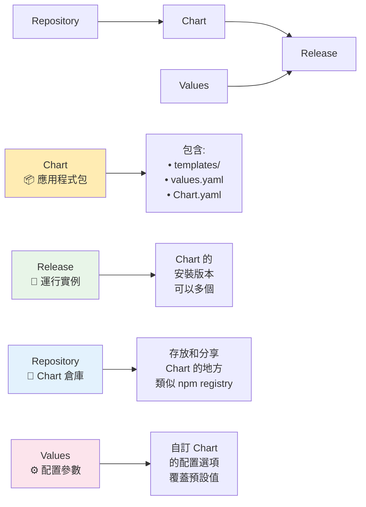
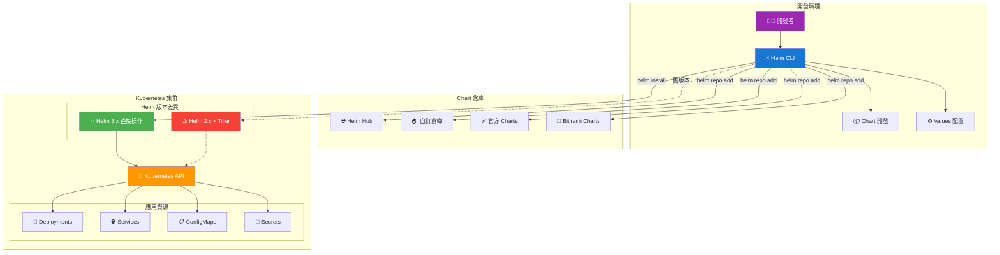
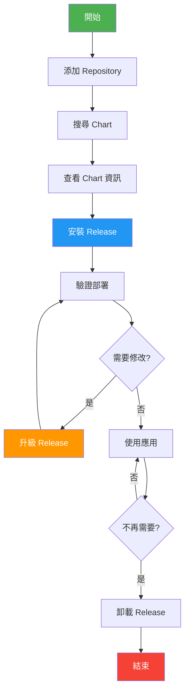

Day 12 Helm 基礎
🎯 學習目標
完成本日學習後，你將能夠：

 理解什麼是 Helm 以及為什麼需要它
 掌握 Helm 的核心概念和架構
 成功安裝和配置 Helm
 執行基本的 Helm 命令操作
 完成第一個應用的安裝和管理
 
📖 理論基礎
什麼是 Helm？
想像你要搭建一個複雜的樂高城堡，如果每次都要一塊一塊地組裝，會非常麻煩。Helm 就像是樂高的「預製套件」，讓你可以快速部署整套 Kubernetes 應用。



Helm 核心概念


Helm 架構圖



🛠️ 實作環節
Lab 1: Helm 安裝與驗證
步驟 1: 安裝 Helm
Linux 用戶：

```bash
# 下載並安裝最新版本
> curl -fsSL -o get_helm.sh https://raw.githubusercontent.com/helm/helm/main/scripts/get-helm-3
> chmod 700 get_helm.sh
> ./get_helm.sh

# 驗證安裝
> helm version
helm version
version.BuildInfo{Version:"v3.18.5", GitCommit:"b78692c18f0fb38fe5ba4571a674de067a4c53a5", GitTreeState:"clean", GoVersion:"go1.24.5"}
```

步驟 2: 檢查 Kubernetes 連接
```bash
# 確保可以連接到 K8s 集群
kubectl cluster-info

# 檢查當前 context
kubectl config current-context

# 如果使用 KinD，確保 Cluster 正在運行
kind get clusters
```

Lab 2: 第一個 Helm 命令
步驟 1: 添加官方 Repository [Binami](https://github.com/bitnami/charts/tree/main/bitnami)
```bash=
# 添加 Bitnami repository（包含很多常用應用）
helm repo add bitnami https://charts.bitnami.com/bitnami

# 更新 repository 資訊
helm repo update

# 查看已添加的 repositories
> helm repo list
# 預期輸出
NAME          	URL                                    
bitnami       	https://charts.bitnami.com/bitnami     
```
步驟 2: 搜尋可用的 Charts
```bash=
# 搜尋 nginx 相關的 charts
helm search repo nginx

# 搜尋所有 bitnami 的 charts
helm search repo bitnami/
```

Lab 3: 安裝第一個應用
步驟 1: 查看 Chart 資訊
```bash
# 查看 nginx chart 的基本資訊
> helm show chart bitnami/nginx

# 基本資訊區塊
NAME: demo-nginx                    # Release 名稱
LAST DEPLOYED: Sun Aug 17 00:45:55 2025  # 最後部署時間
NAMESPACE: default                  # 部署的命名空間
STATUS: deployed                    # 當前狀態（已部署）
REVISION: 1                         # 版本號（第一次安裝）
TEST SUITE: None                    # 測試套件（無）

# Chart 資訊區塊
CHART NAME: nginx                   # Chart 名稱
CHART VERSION: 21.1.22             # Chart 版本
APP VERSION: 1.29.1                # 應用程式版本（Nginx 1.29.1）
```

```bash
# 查看預設的 values（配置選項）
> helm show values bitnami/nginx

這個 values 文件就像是應用程式的「設定檔」，你可以透過修改這些參數來：
- 自訂應用行為
- 調整資源配置
- 設定網路存取
- 配置安全性
```

步驟 2: 安裝 Nginx
```bash=
# 安裝 nginx，release 名稱為 demo-nginx
> helm install demo-nginx bitnami/nginx

# 查看安裝狀態
> helm status demo-nginx
helm status demo-nginx
NAME: demo-nginx
LAST DEPLOYED: Sun Aug 17 00:45:55 2025
NAMESPACE: default
STATUS: deployed
REVISION: 1
TEST SUITE: None
NOTES:
CHART NAME: nginx
CHART VERSION: 21.1.22
APP VERSION: 1.29.1

# 查看所有 releases
> helm list
NAME      	NAMESPACE	REVISION	UPDATED                               	STATUS  CHART        	APP VERSION
demo-nginx	default  	1       	2025-08-17 00:45:55.67752989 +0800 CST	deployednginx-21.1.22	1.29.1     
```

步驟 3: 驗證部署
```bash=
# 查看創建的 Kubernetes 資源
> kubectl get pods
> kubectl get services
> kubectl get deployments

# 查看 nginx pod 的詳細資訊
> kubectl describe pod -l app.kubernetes.io/name=nginx
```

步驟 4: 訪問應用
```bash=
# 使用 port-forward 訪問 nginx
kubectl port-forward svc/my-nginx 8080:80

# 在另一個終端測試
curl http://localhost:8080
```

步驟 5: 卸載 Release

```bash=
# 卸載 nginx
helm uninstall my-nginx

# 驗證卸載
helm list
kubectl get pods
```

Helm  工作流程圖

