# Kubernetes 學習之旅 - 第二天
> 前情提要：昨天我們成功安裝了 KinD 並建立了第一個 Kubernetes 集群。今天我們要深入了解這個集群內部到底有什麼，以及如何用 YAML 來描述我們的應用。

## 🎯 今天的學習目標
作為一個習慣使用 Docker Compose 的後端開發者，今天你將學會：

* 理解 Kubernetes 的內部架構（就像了解 Docker Engine 的組成）
* 理解 K8s YAML 基礎結構（類似 docker-compose.yml）

---

# 1. 重新認識你的 KinD 集群

## 🔄 重建昨天的環境
如果讀這篇的你昨天已經刪除了Cluster，讓我們重新建立：

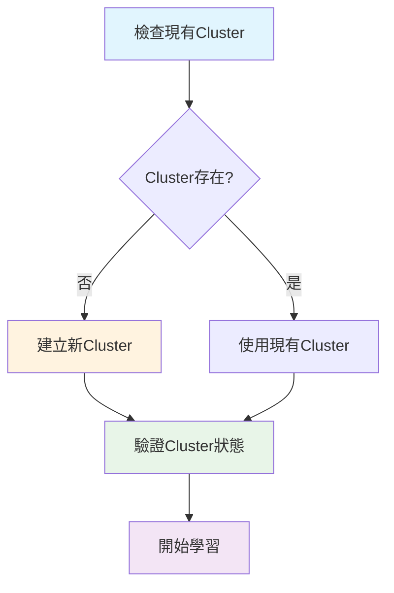

```bash
# 檢查現有Cluster
kind get clusters

# 如果沒有Cluster，建立一個新的
kind create cluster --name learning

# 確認Cluster運作正常
kubectl cluster-info
```

你應該會看到類似這樣的輸出：
```
Kubernetes control plane is running at https://127.0.0.1:xxxxx
CoreDNS is running at https://127.0.0.1:xxxxx/api/v1/namespaces/kube-system/services/kube-dns:dns/proxy

To further debug and diagnose cluster problems, use 'kubectl cluster-info dump'.
```

## 探索Cluster內部
現在讓我們看看這個Cluster裡面到底有什麼。就像你用 `docker ps` 查看運行的容器一樣，我們用以下命令查看 Kubernetes 的組件：

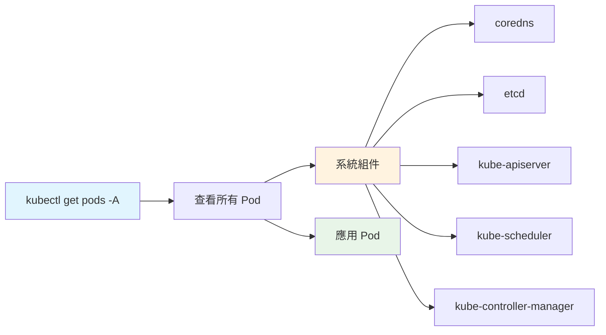

```bash
# 查看所有命名空間中的 Pod（類似 docker ps -a）
kubectl get pods --all-namespaces

# 簡寫形式
kubectl get pods -A
```

💡 **小白提示**：Pod 是 Kubernetes 中最小的部署單位，你可以把它想像成一個或多個緊密相關的容器的組合。

你會看到類似這樣的輸出：
```
NAMESPACE            NAME                                         READY   STATUS    RESTARTS        AGE
kube-system          coredns-674b8bbfcf-mkk29                     1/1     Running   34 (131m ago)   20d
kube-system          coredns-674b8bbfcf-sgwx5                     1/1     Running   34 (131m ago)   20d
kube-system          etcd-learning-control-plane                  1/1     Running   34 (131m ago)   20d
kube-system          kindnet-cnhrt                                1/1     Running   34 (131m ago)   20d
```

🤔 這些都是什麼？別擔心，我們接下來會一一解釋每個組件的作用！

---

# 2. Kubernetes 架構全解析

## 🏢 把 Kubernetes 想像成一家公司
為了更容易理解，我用公司組織來類比 Kubernetes 的架構：

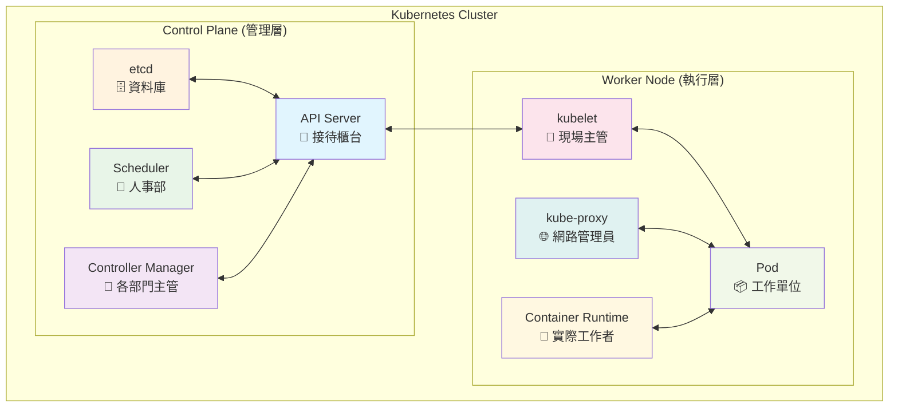

## 🎯 Control Plane（管理層）組件詳解

### 1. API Server - 接待櫃台 🏪

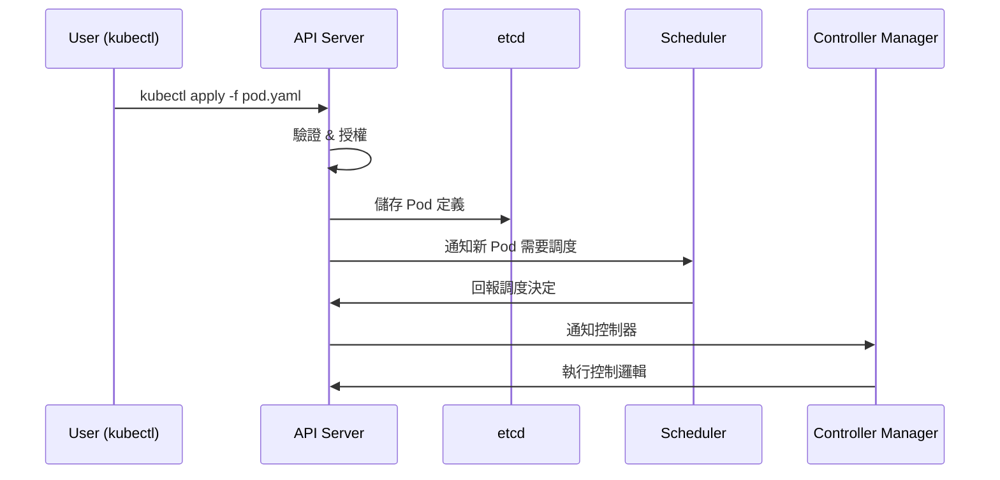

```bash
# 查看 API Server 的詳細資訊
kubectl describe pod -n kube-system kube-apiserver-learning-control-plane 
```

**作用：**
- 就像公司的接待櫃台，所有人（kubectl、其他組件）都要通過它
- 處理所有的 REST API 請求
- 驗證和授權所有操作

**類比 Docker Compose：**
如果 `docker-compose up` 是直接命令，那 `kubectl` 就是通過 API Server 這個「櫃台」來下達命令

### 2. etcd - 公司資料庫 🗄️

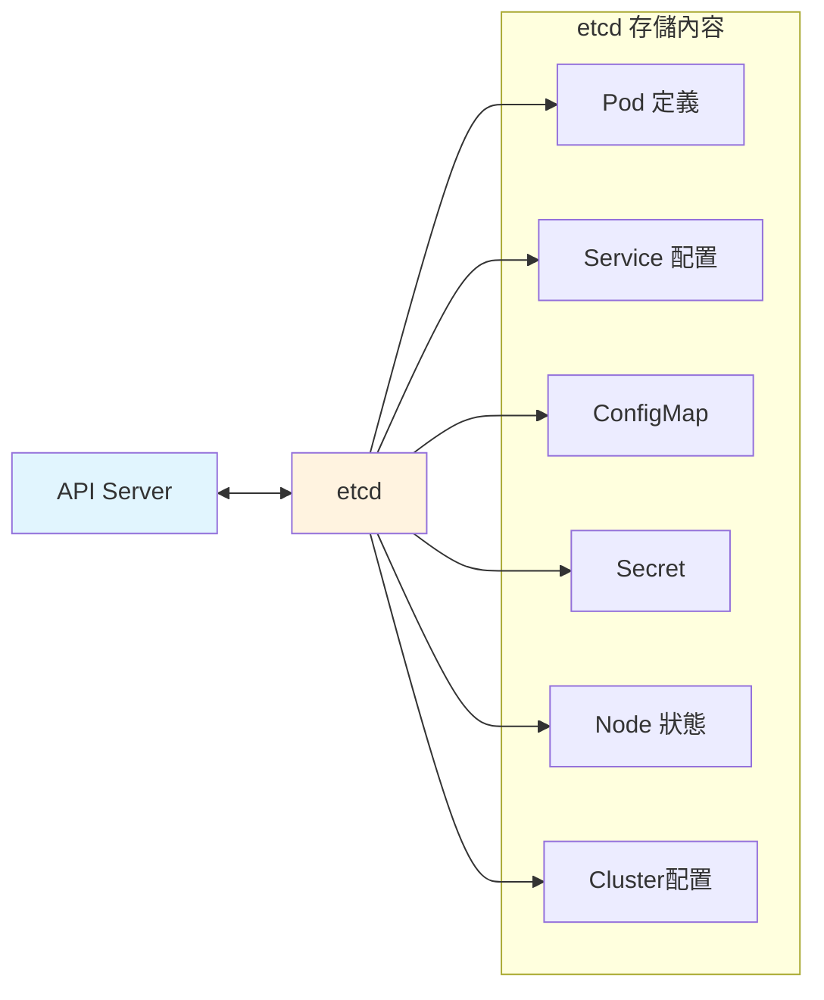

```bash
# 查看 etcd 狀態
kubectl describe pod -n kube-system etcd-learning-control-plane
```

**作用：**
- 儲存Cluster的所有資料（配置、狀態、secret 等）
- 分散式 key-value 儲存，確保資料一致性

**類比 Docker Compose：**
就像你的 docker-compose.yml 檔案，但是是即時更新的動態版本，記錄著「現在應該有什麼服務」和「實際運行什麼服務」

### 3. Scheduler - 人事部 👥

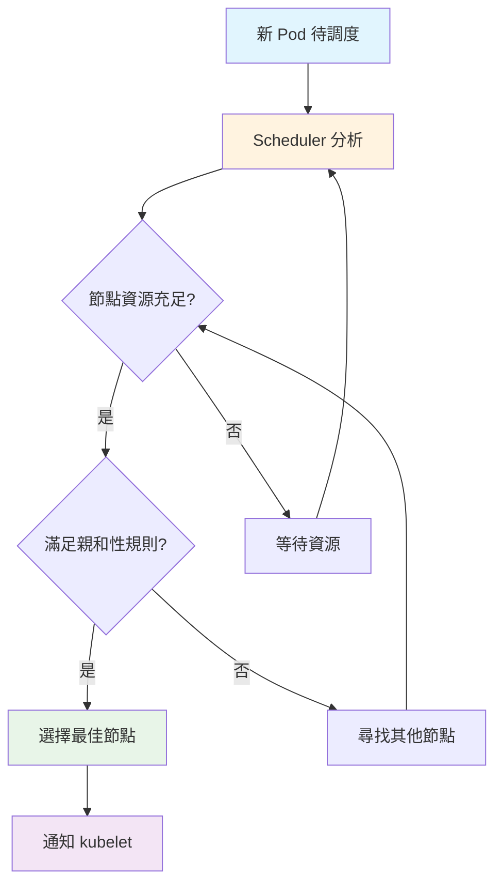

> 親和性，待後續幾篇在解釋

```bash
# 查看 Scheduler
kubectl describe pod -n kube-system kube-scheduler-learning-control-plane
```

**作用：**
- 決定新的 Pod 應該放在哪個 Node 上運行
- 考慮資源需求、約束條件、親和性等

**類比 Docker Compose：**
Docker Compose 只能在一台機器上運行，Scheduler 就像是決定「這個服務要放在哪台伺服器上」的 AI 系統

### 4. Controller Manager - 各部門主管 👔

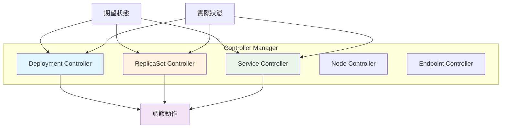

```bash
# 查看 Controller Manager
kubectl describe pod -n kube-system kube-controller-manager-learning-control-plane
```

**作用：**
- 運行各種控制器（Deployment Controller、Service Controller 等）
- 確保實際狀態符合期望狀態

**類比 Docker Compose：**
類似 docker-compose up 的 `--restart=always` 功能，但更聰明：如果你說要 3 個副本，它會確保始終有 3 個在運行

## 🏭 Worker Node（執行層）組件詳解

### 1. kubelet - 現場主管 👷

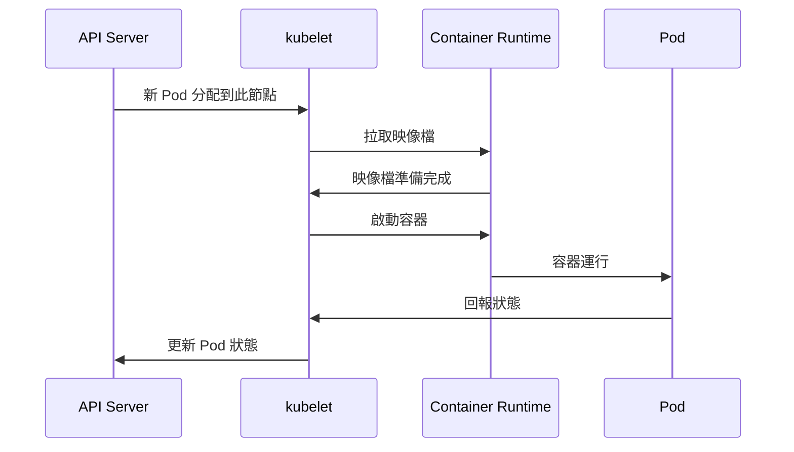

**作用：**
- 每個節點上的代理
- 負責管理該 Node 上的 Pod 生命週期
- 與 API Server 交互，報告 Node 狀態

**類比 Docker Compose：**
類似每台機器上的 Docker Engine，但會主動與總部（API Server）保持聯繫

### 2. kube-proxy - 網路管理員 🌐

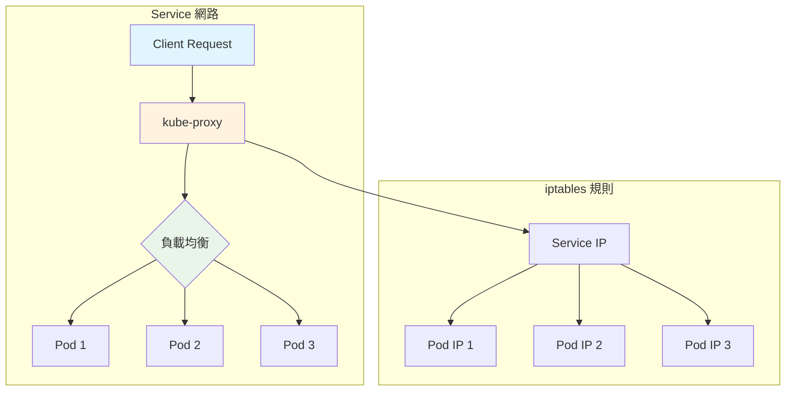

```bash
# 查看 kube-proxy
kubectl get pods -n kube-system | grep kube-proxy
```

**作用：**
- 管理 Node 上的網路規則
- 實現 Service 的負載均衡

**類比 Docker Compose：**
類似 Docker Compose 的網路功能，但可以跨多台機器進行服務發現和負載均衡

### 3. Container Runtime - 實際工作者 🔧

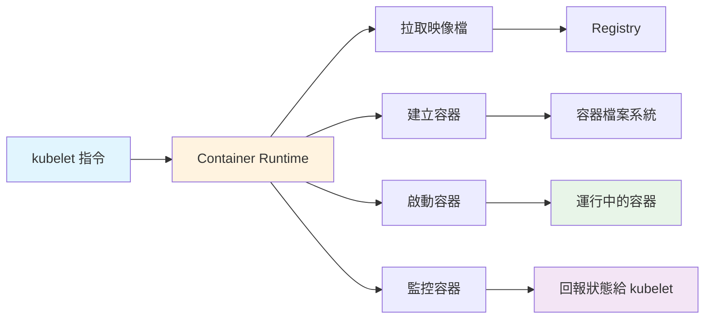

**作用：**
- 實際運行容器的軟體（通常是 containerd 或 Docker）
- Pull image、啟動容器、管理容器生命週期

**類比 Docker Compose：**
就是 Docker Engine 本身，在 Kubernetes 中被 kubelet 管理和調用

## 🔍 實際觀察這些組件
讓我們實際看看這些組件在做什麼：

```bash
# 建立一個測試 Pod 來產生事件
kubectl run test-pod --image=nginx:1.21 --restart=Never

# 查看節點資訊
kubectl get nodes -o wide

# 查看節點詳細資訊
kubectl describe node learning-control-plane

# 查看系統 Pod 的資源使用
kubectl top pods -n kube-system 2>/dev/null || echo "需要安裝 metrics-server"

# 查看集群事件（類似系統日誌）
kubectl get events --sort-by=.metadata.creationTimestamp
```

**事件的生命週期**

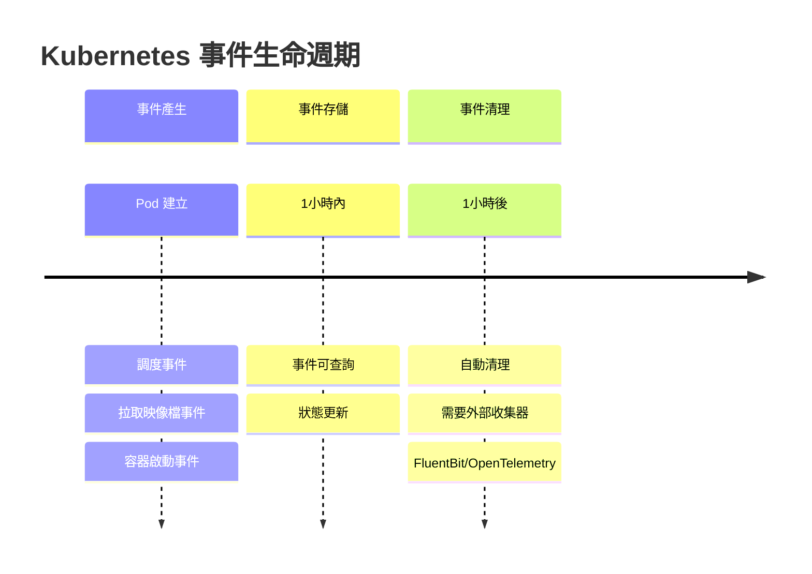

Kubernetes 事件有時間限制：
- 預設保存時間：1小時
- 事件類型：Normal（正常）和 Warning（警告）
- 自動清理：舊事件會被自動刪除

---

# 3. YAML 基礎：從 Docker Compose 到 K8s

## 📝 YAML 語法快速回顧
如果你熟悉 Docker Compose，那你已經知道 YAML 的基本語法了：

```mermaid
graph LR
    subgraph "YAML 基本語法"
      A["鍵值對<br/>key: value"]
      B["列表<br/>- item1<br/>- item2"]
      C["巢狀結構<br/>parent:<br/>  child: value"]
      D["多行文字<br/>text: &#124;<br/>  line1<br/>  line2"]
    end

    style A fill:#e1f5fe
    style B fill:#fff3e0
    style C fill:#e8f5e8
    style D fill:#f3e5f5
```

```yaml
# 這是註解
key: value                    # 鍵值對
list:                         # 列表
- item1
- item2
nested:                       # 巢狀結構
subkey: subvalue
multiline: |                  # 多行文字
這是第一行
這是第二行
```

## 🏗️ Kubernetes YAML 的通用結構

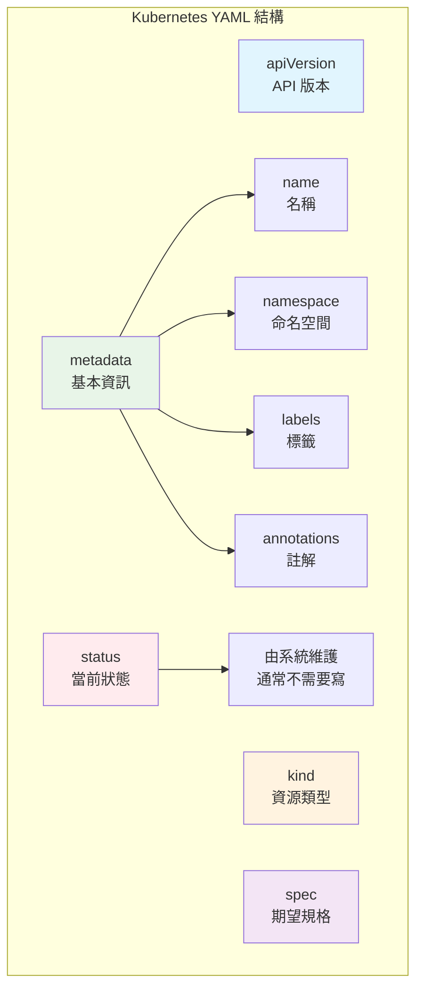

> Namespace（命名空間），待後續幾篇在解釋

每個 Kubernetes 資源都遵循相同的基本結構：
```yaml
apiVersion: <API版本>          # 類似 Docker Compose 的 version
kind: <資源類型>               # 類似 Docker Compose 的 services/volumes/networks
metadata:                     # 資源的基本資訊
name: <資源名稱>
namespace: <命名空間>         # 類似資料夾概念，預設是 default
labels:                     # 標籤，用於選擇和組織
  app: myapp
  version: v1
annotations:                # 註解，用於存放額外資訊
  description: "這是我的應用"
spec:                         # 資源的具體規格（你想要什麼）
# 這裡的內容根據 kind 而不同
status:                       # 資源的當前狀態（系統維護，通常不需要寫）
# Kubernetes 自動填寫
```

## 🔍 使用 kubectl explain 學習

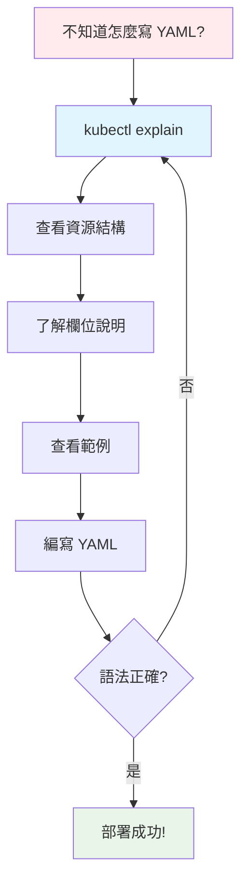

這是學習 Kubernetes YAML 的最佳工具，就像查閱 API 文件一樣：
```bash
# 了解 Pod 的基本結構
kubectl explain pod

# 深入了解 Pod 的 spec 部分
kubectl explain pod.spec

# 查看 Pod 容器的配置選項
kubectl explain pod.spec.containers

# 了解 Deployment
kubectl explain deployment
kubectl explain deployment.spec

# 查看所有可用的資源類型
kubectl api-resources
```

💡 **小白提示**：每當你不確定某個欄位怎麼寫時，就用 kubectl explain 查詢！

---

# 4. 實戰：第一個 Kubernetes 應用

## 🚀 從最簡單的 Pod 開始

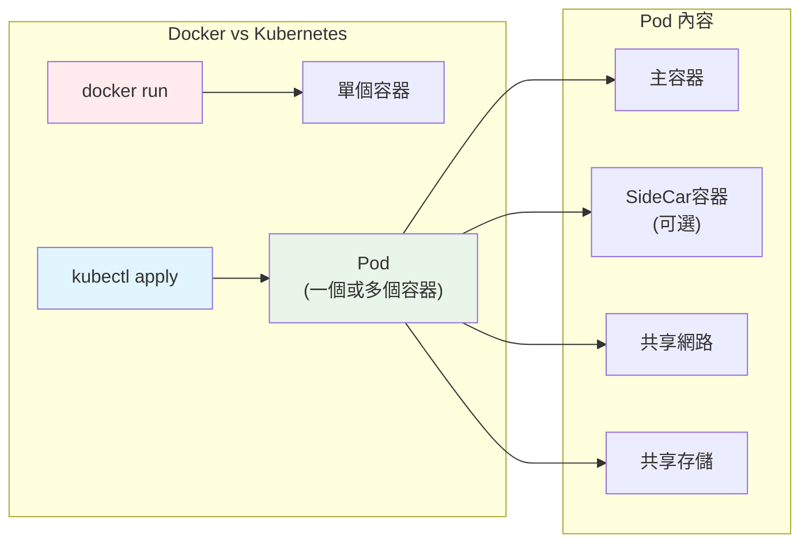

讓我們建立第一個 Pod，就像你第一次寫 docker run 命令一樣：

```yaml
# first-pod.yaml
apiVersion: v1                # Pod 是 v1 API 的一部分
kind: Pod                     # 資源類型是 Pod
metadata:
name: hello-pod             # Pod 的名稱
labels:
  app: hello                # 標籤，方便後續選擇
  environment: learning     # 環境標籤
spec:
containers:                 # 容器列表（一個 Pod 可以有多個容器）
- name: hello-container     # 容器名稱
  image: nginx:1.29.0-otel  # 映像檔，就像 Docker 一樣
  ports:
  - containerPort: 80       # 容器內部埠號
  env:                      # 環境變數
  - name: ENVIRONMENT
    value: "learning"
  resources:                # 資源限制（Docker Compose 也有類似功能）
    requests:               # 最少需要的資源
      memory: "64Mi"
      cpu: "250m"           # 250 milliCPU = 0.25 CPU
    limits:                 # 最多能使用的資源
      memory: "128Mi"
      cpu: "500m"
```

## 🔄 與 Docker 命令的對比：

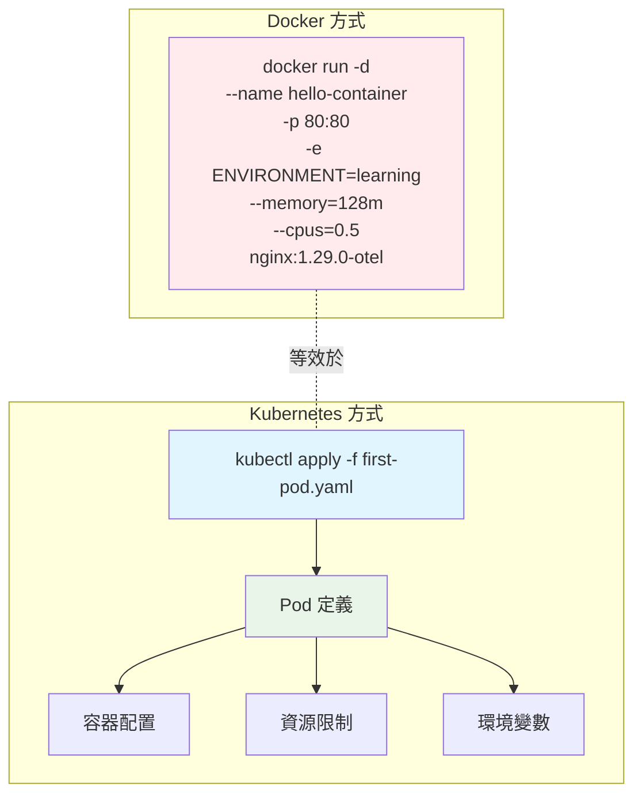

```bash
# 這個 Pod 相當於以下 Docker 命令：
docker run -d \
--name hello-container \
-p 80:80 \
-e ENVIRONMENT=learning \
--memory=128m \
--cpus=0.5 \
nginx:1.29.0-otel 
```

## 🎯 部署你的第一個 Pod

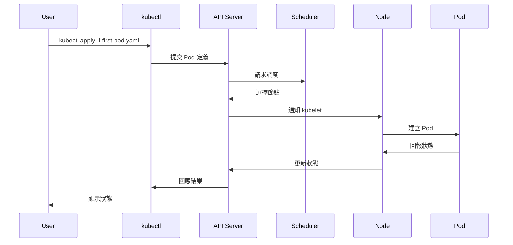

```bash
# 建立 Pod
kubectl apply -f first-pod.yaml

# 查看 Pod 狀態
kubectl get pods

# 查看詳細資訊
kubectl describe pod hello-pod

# 查看 Pod 日誌（類似 docker logs）
kubectl logs hello-pod

# 進入 Pod 內部（類似 docker exec）
kubectl exec -it hello-pod -- /bin/bash

# 在容器內測試
curl localhost
exit

# 從外部訪問 Pod（類似 docker port-forward）
kubectl port-forward pod/hello-pod 8080:80
```

打開另一個 Terminal 或瀏覽器測試：
```bash
curl http://localhost:8080
```
你應該會看到 Nginx 的歡迎頁面！

## 🧹 清理第一個 Pod

```bash
# 刪除 Pod
kubectl delete pod hello-pod

# 或者使用檔案刪除
kubectl delete -f first-pod.yaml
```

---

# 📚 總結
透過比喻的手法，讓一開始接觸 K8s 的我能有更具體的想像來理解各組件之間的職責與關係。再從熟稔的 docker compose 設計的角度做個對比。


## 🧪 Lab 實作內容

### **Lab 1: Cluster 環境準備**
- ✅ 使用 KinD 建立本地Cluster 
- ✅ 驗證集群狀態：`kubectl cluster-info`
- ✅ 探索系統組件：`kubectl get pods -A`

### **Lab 2: 架構組件觀察**
- ✅ 查看 Control Plane 組件詳細資訊
- ✅ 觀察系統事件：`kubectl get events`
- ✅ 理解各組件的角色和功能

### **Lab 3: YAML 語法學習**
- ✅ 使用 `kubectl explain` 學習資源結構
- ✅ 查看可用資源類型：`kubectl api-resources`
- ✅ 理解 Kubernetes YAML 的通用格式

### **Lab 4: 第一個應用部署**
- ✅ 建立 Pod YAML 檔案
- ✅ 部署應用：`kubectl apply -f first-pod.yaml`
- ✅ 管理 Pod 生命週期：查看、日誌、進入、刪除
- ✅ 測試網路訪問：`kubectl port-forward`

## 🎯 學習成果檢驗

完成今天學習後，你應該能夠：

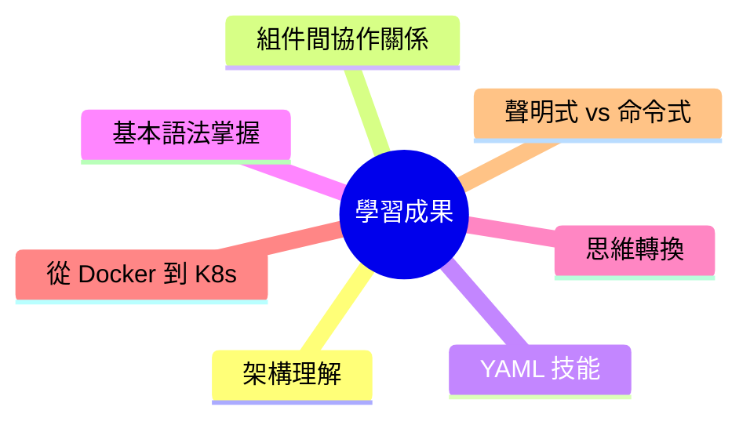

- **🔍 解釋** Kubernetes 架構中每個組件的作用
- **📝 編寫** 基本的 Pod YAML 檔案
