# Kubernetes 學習 - Day 4: Deployment 基礎

## 📚 今日學習目標

> **從手動管理 Pod 到自動化的 Deployment 管理**

### 🎯 學習成果
✅ 理解什麼是 Deployment 及其作用
✅ 掌握 Deployment 與 Pod 的關係
✅ 學會建立和管理基本的 Deployment
✅ 熟悉常用的 Deployment 操作指令

---

## 🚀 什麼是 Deployment？

### 簡單比喻
想像你是餐廳老闆：
- **Pod** = 一個服務員
- **Deployment** = 人事經理，負責管理所有服務員

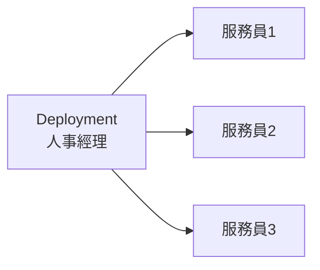

### 為什麼需要 Deployment？

**手動管理 Pod 的問題：**
```bash
# 😰 如果 Pod 掛了，你得手動重啟
kubectl delete pod nginx-pod
kubectl apply -f nginx-pod.yaml
```

**Deployment 自動幫你：**
- ✅ Pod 掛了自動重啟
- ✅ 想要 3 個副本就維持 3 個
- ✅ 更新應用不用停機

## 📝 最簡單的 Deployment

```yaml
# simple-deployment.yaml
apiVersion: apps/v1
kind: Deployment
metadata:
  name: nginx-deployment
spec:
  replicas: 3                    # 我要 3 個 Pod
  selector:
    matchLabels:
      app: nginx
  template:                      # Pod 的模板
    metadata:
      labels:
        app: nginx
    spec:
      containers:
      - name: nginx
        image: nginx:1.20
        ports:
        - containerPort: 80
```

YAML 欄位說明
- replicas: 想要的 Pod 數量
- selector: 告訴 Deployment 要管理哪些 Pod
- template: Pod 的模板，就像 Day 3 學的 Pod YAML

## 🛠️ 基本操作
**部署和查看**
```bash
# 建立 Deployment
kubectl apply -f simple-deployment.yaml

# 查看 Deployment 狀態
kubectl get deployments
kubectl get deploy nginx-deployment

# 查看 Pod（會看到 3 個 Pod）
kubectl get pods

# 查看詳細資訊
kubectl describe deployment nginx-deployment
```

**擴縮容操作**
```bash
# 擴展到 5 個副本
kubectl scale deployment nginx-deployment --replicas=5

# 縮減到 2 個副本
kubectl scale deployment nginx-deployment --replicas=2

# 查看變化
kubectl get pods -w  # -w 表示持續觀察
```

**更新和回滾**
```bash
# 更新映像檔版本
kubectl set image deployment/nginx-deployment nginx=nginx:1.21

# 查看更新狀態
kubectl rollout status deployment/nginx-deployment

# 查看更新歷史
kubectl rollout history deployment/nginx-deployment

# 回滾到上一個版本
kubectl rollout undo deployment/nginx-deployment
```

🧪 實際演練
步驟 1：建立你的第一個 Deployment
```bash
# 建立 YAML 檔案
cat > my-first-deployment.yaml << EOF
apiVersion: apps/v1
kind: Deployment
metadata:
  name: my-nginx
spec:
  replicas: 2
  selector:
    matchLabels:
      app: my-nginx
  template:
    metadata:
      labels:
        app: my-nginx
    spec:
      containers:
      - name: nginx
        image: nginx:1.20
        ports:
        - containerPort: 80
EOF

# 部署
kubectl apply -f my-first-deployment.yaml
```

步驟 2：觀察 Deployment 行為
```bash
# 查看狀態
kubectl get deployments
kubectl get pods

# 刪除一個 Pod，看看會發生什麼
kubectl delete pod <pod-name>

# 再次查看 Pod（應該會自動建立新的）
kubectl get pods
```

步驟 3：練習擴縮容
```bash
# 擴展到 4 個副本
kubectl scale deployment my-nginx --replicas=4

# 觀察 Pod 變化
kubectl get pods

# 縮減回 1 個副本
kubectl scale deployment my-nginx --replicas=1
```

🔧 常見問題排除
Deployment 卡在 Pending 狀態
```bash
# 檢查 Deployment 狀態
kubectl describe deployment nginx-deployment

# 檢查 Pod 狀態
kubectl describe pods

# 常見原因：
# - 映像檔拉取失敗
# - 資源不足
# - 節點問題
```

Pod 不斷重啟
```bash
# 查看 Pod 日誌
kubectl logs <pod-name>

# 查看 Pod 事件
kubectl describe pod <pod-name>

# 常見原因：
# - 應用程式錯誤
# - 健康檢查失敗
# - 資源限制
```

🎯 今日重點回顧
核心概念
Deployment = 自動化的 Pod 管理員
replicas = 想要的 Pod 數量
selector = 管理哪些 Pod
template = Pod 的藍圖
必記指令
```bash
kubectl apply -f deployment.yaml      # 建立/更新
kubectl get deployments              # 查看狀態
kubectl scale deployment <name> --replicas=<數量>  # 擴縮容
kubectl rollout status deployment/<name>           # 查看更新狀態
```

實用技巧
用 kubectl get pods -w 觀察 Pod 變化
刪除 Pod 測試自動恢復功能
先用小數量副本測試，確認無誤再擴展

## 🐳 從 Docker Compose 理解 Deployment

### 為什麼需要 Deployment？

**Docker Compose 的限制：**
```yaml
# docker-compose.yml
version: '3'
services:
web:
  image: nginx:1.20
  deploy:
    replicas: 3  # 啟動 3 個副本
  ports:
    - "80:80"
```

**問題：**
- ❌ 手動管理副本數量
- ❌ 更新時需要停機
- ❌ 無法自動故障恢復
- ❌ 缺乏版本控制和回滾機制

### Deployment 的解決方案

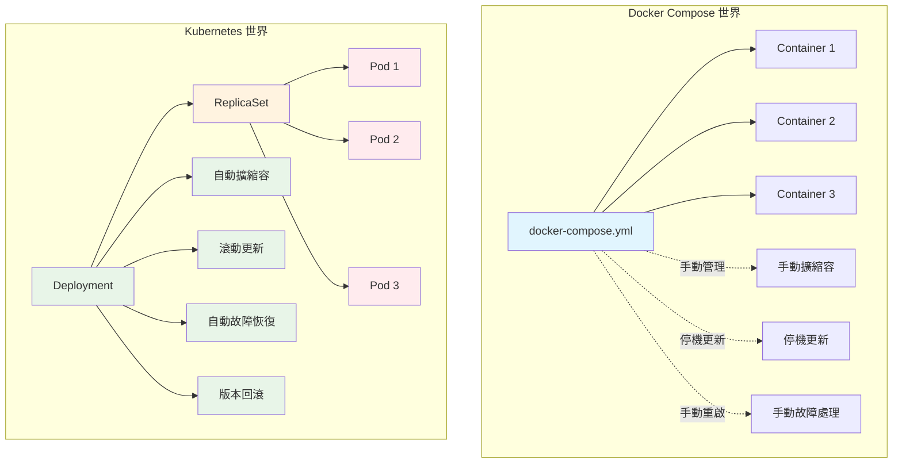


### 核心概念對比表

| 概念 | Docker Compose | Kubernetes Deployment |
|------|----------------|------------------------|
| **副本管理** | `deploy.replicas: 3` | `spec.replicas: 3` |
| **更新策略** | 停機重建 | 滾動更新/重建 |
| **故障恢復** | 手動重啟 | 自動重啟和替換 |
| **版本控制** | 無 | 自動版本歷史 |
| **回滾機制** | 手動 | `kubectl rollout undo` |
| **健康檢查** | 基本檢查 | 多層探針檢查 |
| **負載均衡** | 外部負載均衡器 | Service 自動負載均衡 |

---

## 📝 Deployment YAML 完整解析

### 從 Docker Compose 到 Deployment

```yaml
# docker-compose.yml - Docker Compose 版本
version: '3'
services:
web:
  image: nginx:1.20
  deploy:
    replicas: 3
    update_config:
      parallelism: 1
      delay: 10s
    restart_policy:
      condition: any
  ports:
    - "80:80"
  environment:
    - ENV=production
  healthcheck:
    test: ["CMD", "curl", "-f", "http://localhost"]
    interval: 30s
    timeout: 10s
    retries: 3
```

```yaml
# nginx-deployment.yaml - Kubernetes Deployment 版本
apiVersion: apps/v1
kind: Deployment
metadata:
name: nginx-deployment
labels:
  app: nginx
  version: v1.0
annotations:
  deployment.kubernetes.io/revision: "1"
spec:
# 副本數量
replicas: 3

# 標籤選擇器 - 管理哪些 Pod
selector:
  matchLabels:
    app: nginx

# 更新策略
strategy:
  type: RollingUpdate
  rollingUpdate:
    maxUnavailable: 1      # 最多 1 個 Pod 不可用
    maxSurge: 1           # 最多多出 1 個 Pod

# Pod 模板
template:
  metadata:
    labels:
      app: nginx
      version: v1.0
  spec:
    containers:
    - name: nginx
      image: nginx:1.20
      ports:
      - containerPort: 80
        name: http
      
      # 環境變數
      env:
      - name: ENV
        value: "production"
      
      # 資源限制
      resources:
        requests:
          memory: "128Mi"
          cpu: "100m"
        limits:
          memory: "256Mi"
          cpu: "200m"
      
      # 健康檢查
      livenessProbe:
        httpGet:
          path: /
          port: 80
        initialDelaySeconds: 30
        periodSeconds: 10
        timeoutSeconds: 5
        failureThreshold: 3
      
      readinessProbe:
        httpGet:
          path: /
          port: 80
        initialDelaySeconds: 5
        periodSeconds: 5
        timeoutSeconds: 3
        failureThreshold: 3
```

### Deployment YAML 欄位詳解圖

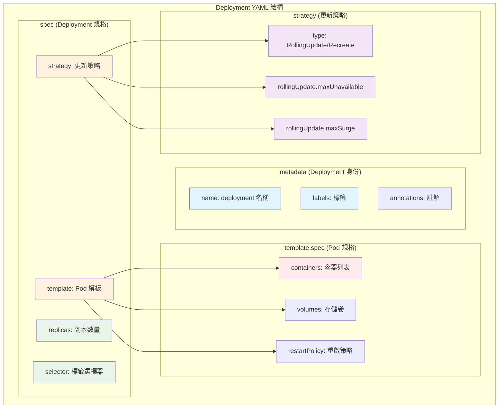

---

## 🛠️ 實作 1：創建和管理基本 Deployment

### 步驟 1：創建第一個 Deployment

```yaml
# simple-deployment.yaml
apiVersion: apps/v1
kind: Deployment
metadata:
name: nginx-simple
labels:
  app: nginx
spec:
replicas: 3
selector:
  matchLabels:
    app: nginx
template:
  metadata:
    labels:
      app: nginx
  spec:
    containers:
    - name: nginx
      image: nginx:1.20
      ports:
      - containerPort: 80
      resources:
        requests:
          memory: "64Mi"
          cpu: "50m"
        limits:
          memory: "128Mi"
          cpu: "100m"
```

```bash
# 創建 Deployment
kubectl apply -f simple-deployment.yaml

# 查看 Deployment 狀態
kubectl get deployments
kubectl get deployment nginx-simple -o wide

# 查看 ReplicaSet
kubectl get replicasets
kubectl get rs -l app=nginx

# 查看 Pod
kubectl get pods -l app=nginx
kubectl get pods -l app=nginx -o wide
```

### 步驟 2：觀察 Deployment 創建過程

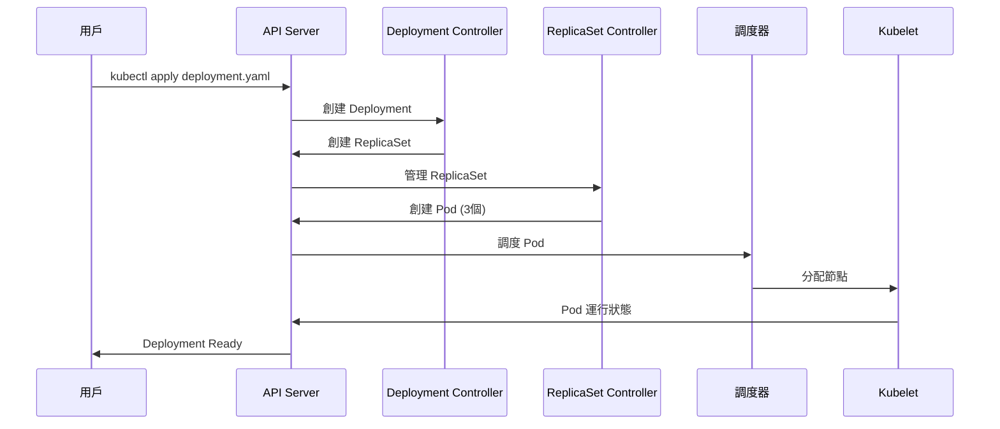

```bash
# 實時觀察創建過程
kubectl get deployments -w

# 查看詳細事件
kubectl describe deployment nginx-simple

# 查看 Deployment 管理的資源
kubectl get all -l app=nginx
```

### 步驟 3：擴縮容操作

```bash
# 擴容到 5 個副本
kubectl scale deployment nginx-simple --replicas=5

# 觀察擴容過程
kubectl get pods -l app=nginx -w

# 縮容到 2 個副本
kubectl scale deployment nginx-simple --replicas=2

# 使用 YAML 方式修改副本數
kubectl patch deployment nginx-simple -p '{"spec":{"replicas":4}}'

# 查看擴縮容歷史
kubectl describe deployment nginx-simple | grep -A 10 Events
```

### 擴縮容過程圖解

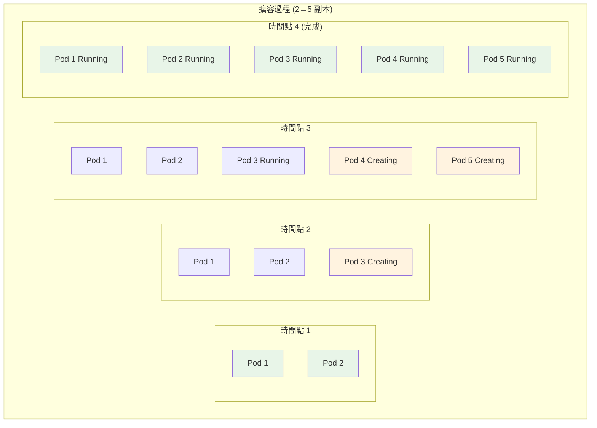

---

## 🔄 實作 2：滾動更新和版本回滾

### Docker Compose vs Kubernetes 更新對比

```yaml
# docker-compose.yml - 停機更新
version: '3'
services:
web:
  image: nginx:1.21  # 更新映像版本
  # ❌ 需要 docker-compose down && docker-compose up
  # ❌ 服務中斷
```

```bash
# Kubernetes - 零停機滾動更新
kubectl set image deployment/nginx-simple nginx=nginx:1.21
# ✅ 零停機更新
# ✅ 自動回滾機制
```

### 滾動更新詳細配置

```yaml
# rolling-update-deployment.yaml
apiVersion: apps/v1
kind: Deployment
metadata:
name: nginx-rolling
labels:
  app: nginx-rolling
spec:
replicas: 6
selector:
  matchLabels:
    app: nginx-rolling

# 滾動更新策略詳細配置
strategy:
  type: RollingUpdate
  rollingUpdate:
    maxUnavailable: 2      # 最多 2 個 Pod 不可用 (33%)
    maxSurge: 2           # 最多多出 2 個 Pod (33%)

# 更新進度設定
progressDeadlineSeconds: 600  # 10 分鐘內完成更新
revisionHistoryLimit: 10      # 保留 10 個版本歷史

template:
  metadata:
    labels:
      app: nginx-rolling
      version: v1.0
  spec:
    containers:
    - name: nginx
      image: nginx:1.20
      ports:
      - containerPort: 80
      
      # 優雅關閉設定
      lifecycle:
        preStop:
          exec:
            command: ["/bin/sh", "-c", "sleep 10"]
      
      # 就緒探針 - 確保新 Pod 準備好才接收流量
      readinessProbe:
        httpGet:
          path: /
          port: 80
        initialDelaySeconds: 5
        periodSeconds: 2
        timeoutSeconds: 1
        successThreshold: 1
        failureThreshold: 3
      
      resources:
        requests:
          memory: "64Mi"
          cpu: "50m"
        limits:
          memory: "128Mi"
          cpu: "100m"
    
    # 優雅關閉時間
    terminationGracePeriodSeconds: 30
```

### 滾動更新過程可視化

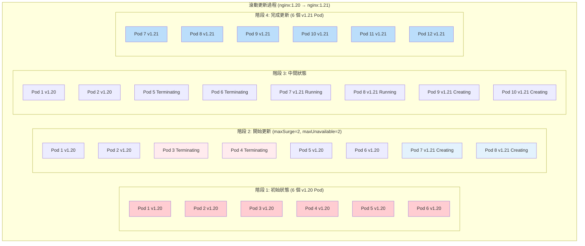

### 實際執行滾動更新

```bash
# 創建初始 Deployment
kubectl apply -f rolling-update-deployment.yaml

# 查看初始狀態
kubectl get pods -l app=nginx-rolling -o wide

# 執行滾動更新 - 方法 1：使用 set image
kubectl set image deployment/nginx-rolling nginx=nginx:1.21

# 執行滾動更新 - 方法 2：編輯 Deployment
kubectl edit deployment nginx-rolling
# 修改 image: nginx:1.21

# 執行滾動更新 - 方法 3：使用 patch
kubectl patch deployment nginx-rolling -p '{"spec":{"template":{"spec":{"containers":[{"name":"nginx","image":"nginx:1.21"}]}}}}'

# 實時觀察更新過程
kubectl rollout status deployment/nginx-rolling

# 查看更新進度
kubectl get pods -l app=nginx-rolling -w
```

### 監控滾動更新

```bash
# 查看 rollout 狀態
kubectl rollout status deployment/nginx-rolling --timeout=300s

# 查看 rollout 歷史
kubectl rollout history deployment/nginx-rolling

# 查看特定版本詳情
kubectl rollout history deployment/nginx-rolling --revision=2

# 暫停 rollout
kubectl rollout pause deployment/nginx-rolling

# 恢復 rollout
kubectl rollout resume deployment/nginx-rolling
```

### 版本回滾操作

```bash
# 回滾到上一個版本
kubectl rollout undo deployment/nginx-rolling

# 回滾到特定版本
kubectl rollout undo deployment/nginx-rolling --to-revision=1

# 查看回滾狀態
kubectl rollout status deployment/nginx-rolling

# 驗證回滾結果
kubectl get pods -l app=nginx-rolling -o jsonpath='{.items[0].spec.containers[0].image}'
```

### 回滾過程圖解

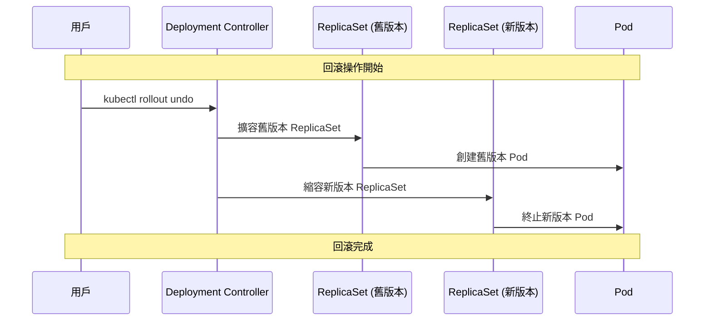

---

## ⚙️ 實作 3：更新策略對比 (RollingUpdate vs Recreate)

### 策略對比表

| 特性 | RollingUpdate | Recreate |
|------|---------------|----------|
| **服務可用性** | 零停機 | 短暫停機 |
| **資源使用** | 更多資源 (maxSurge) | 相同資源 |
| **更新速度** | 較慢 | 較快 |
| **複雜度** | 較複雜 | 簡單 |
| **適用場景** | 生產環境 | 開發/測試環境 |
| **數據一致性** | 可能有版本混合 | 版本一致 |

### RollingUpdate 策略詳解

```yaml
# rolling-update-strategy.yaml
apiVersion: apps/v1
kind: Deployment
metadata:
name: rolling-example
spec:
replicas: 4
strategy:
  type: RollingUpdate
  rollingUpdate:
    maxUnavailable: 25%    # 最多 1 個 Pod 不可用
    maxSurge: 25%         # 最多多出 1 個 Pod
selector:
  matchLabels:
    app: rolling-example
template:
  metadata:
    labels:
      app: rolling-example
  spec:
    containers:
    - name: app
      image: nginx:1.20
      ports:
      - containerPort: 80
      readinessProbe:
        httpGet:
          path: /
          port: 80
        initialDelaySeconds: 5
        periodSeconds: 2
```

### Recreate 策略詳解

```yaml
# recreate-strategy.yaml
apiVersion: apps/v1
kind: Deployment
metadata:
name: recreate-example
spec:
replicas: 4
strategy:
  type: Recreate  # 重建策略
selector:
  matchLabels:
    app: recreate-example
template:
  metadata:
    labels:
      app: recreate-example
  spec:
    containers:
    - name: app
      image: nginx:1.20
      ports:
      - containerPort: 80
```

### 策略對比可視化

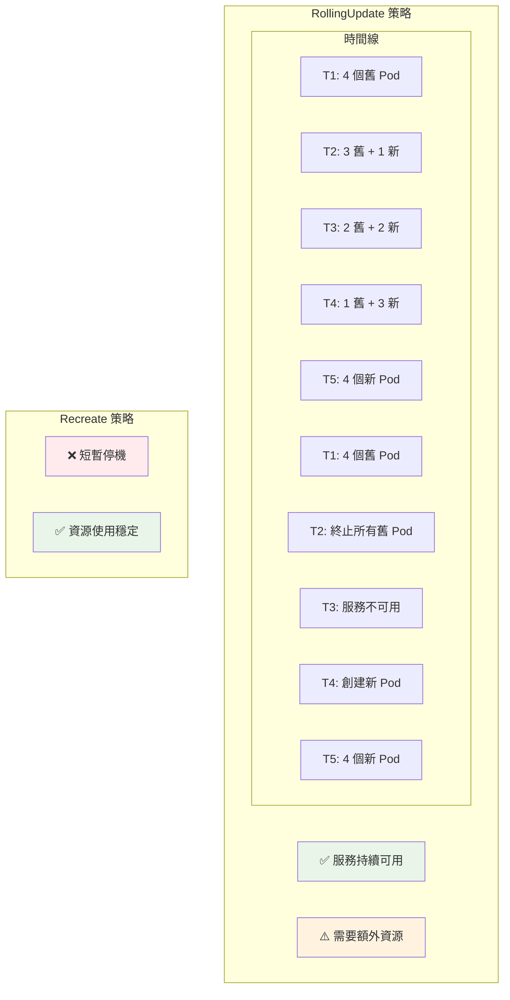

### 實際測試兩種策略

```bash
# 測試 RollingUpdate 策略
kubectl apply -f rolling-update-strategy.yaml

# 監控更新過程
kubectl get pods -l app=rolling-example -w &

# 執行更新
kubectl set image deployment/rolling-example app=nginx:1.21

# 觀察 Pod 變化（應該看到逐步替換）
kubectl get pods -l app=rolling-example

# 測試 Recreate 策略
kubectl apply -f recreate-strategy.yaml

# 監控更新過程
kubectl get pods -l app=recreate-example -w &

# 執行更新
kubectl set image deployment/recreate-example app=nginx:1.21

# 觀察 Pod 變化（應該看到全部終止後重建）
kubectl get pods -l app=recreate-example
```

---

## 🏷️ 實作 4：標籤選擇器管理 Pod 集

### 標籤選擇器概念圖

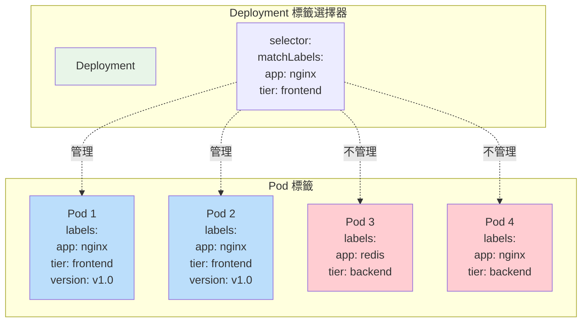

### 複雜標籤選擇器示例

```yaml
# advanced-selector-deployment.yaml
apiVersion: apps/v1
kind: Deployment
metadata:
name: advanced-selector
labels:
  app: web-app
  component: frontend
spec:
replicas: 3

# 複雜的標籤選擇器
selector:
  matchLabels:
    app: web-app
    tier: frontend
  matchExpressions:
  - key: environment
    operator: In
    values: ["production", "staging"]
  - key: version
    operator: NotIn
    values: ["deprecated"]
  - key: feature-flag
    operator: Exists
  - key: legacy
    operator: DoesNotExist

template:
  metadata:
    labels:
      app: web-app
      tier: frontend
      environment: production
      version: v2.0
      feature-flag: "enabled"
      # 注意：沒有 legacy 標籤
  spec:
    containers:
    - name: web
      image: nginx:1.21
      ports:
      - containerPort: 80
```

### 標籤選擇器操作符說明

| 操作符 | 說明 | 示例 | 匹配條件 |
|--------|------|------|----------|
| **In** | 值在列表中 | `operator: In`<br/>`values: ["prod", "stage"]` | `env=prod` 或 `env=stage` |
| **NotIn** | 值不在列表中 | `operator: NotIn`<br/>`values: ["test"]` | `env≠test` |
| **Exists** | 標籤存在 | `operator: Exists` | 有 `feature-flag` 標籤 |
| **DoesNotExist** | 標籤不存在 | `operator: DoesNotExist` | 沒有 `legacy` 標籤 |

### 實際測試標籤選擇器

```bash
# 創建 Deployment
kubectl apply -f advanced-selector-deployment.yaml

# 查看 Deployment 管理的 Pod
kubectl get pods -l app=web-app,tier=frontend

# 測試不同的標籤查詢
kubectl get pods -l app=web-app                    # 按 app 標籤
kubectl get pods -l tier=frontend                  # 按 tier 標籤
kubectl get pods -l environment=production         # 按 environment 標籤
kubectl get pods -l 'environment in (production,staging)'  # 使用 In 操作符

# 查看 Pod 的所有標籤
kubectl get pods --show-labels

# 添加標籤到現有 Pod
kubectl label pod <pod-name> new-label=value

# 移除標籤
kubectl label pod <pod-name> new-label-

# 修改標籤
kubectl label pod <pod-name> environment=staging --overwrite
```

### 標籤管理最佳實踐

```yaml
# label-best-practices.yaml
apiVersion: apps/v1
kind: Deployment
metadata:
name: web-app-production
labels:
  # 推薦的標籤結構
  app.kubernetes.io/name: web-app
  app.kubernetes.io/instance: web-app-production
  app.kubernetes.io/version: "v2.1.0"
  app.kubernetes.io/component: frontend
  app.kubernetes.io/part-of: e-commerce-platform
  app.kubernetes.io/managed-by: kubectl
spec:
replicas: 3
selector:
  matchLabels:
    app.kubernetes.io/name: web-app
    app.kubernetes.io/instance: web-app-production
template:
  metadata:
    labels:
      app.kubernetes.io/name: web-app
      app.kubernetes.io/instance: web-app-production
      app.kubernetes.io/version: "v2.1.0"
      app.kubernetes.io/component: frontend
      app.kubernetes.io/part-of: e-commerce-platform
      app.kubernetes.io/managed-by: kubectl
      # 自定義標籤
      environment: production
      tier: frontend
      team: frontend-team
  spec:
    containers:
    - name: web
      image: nginx:1.21
      ports:
      - containerPort: 80
```

### 標籤組織策略圖

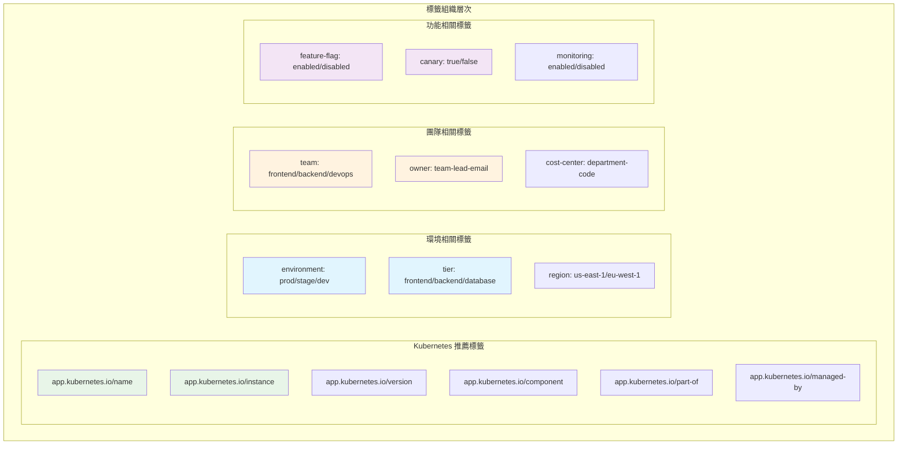

---

## 📊 實作 5：監控 Deployment 狀態和事件

### Deployment 狀態監控全景圖

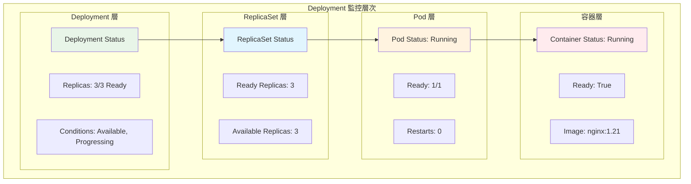

### 完整的監控命令集

```bash
# ============ Deployment 狀態監控 ============

# 1. 基本狀態查看
kubectl get deployments                           # 所有 Deployment
kubectl get deployment nginx-deployment           # 特定 Deployment
kubectl get deployment nginx-deployment -o wide   # 詳細信息
kubectl get deployment nginx-deployment -o yaml   # 完整 YAML

# 2. 實時狀態監控
kubectl get deployments -w                        # 實時監控所有
kubectl get deployment nginx-deployment -w        # 實時監控特定

# 3. 詳細狀態描述
kubectl describe deployment nginx-deployment      # 🔥 最重要的監控命令

# 4. 自定義輸出格式
kubectl get deployment nginx-deployment -o custom-columns=\
NAME:.metadata.name,\
READY:.status.readyReplicas,\
UP-TO-DATE:.status.updatedReplicas,\
AVAILABLE:.status.availableReplicas,\
AGE:.metadata.creationTimestamp

# ============ ReplicaSet 監控 ============

# 5. ReplicaSet 狀態
kubectl get replicasets                           # 所有 ReplicaSet
kubectl get rs -l app=nginx                       # 按標籤過濾
kubectl describe rs <replicaset-name>             # ReplicaSet 詳情

# ============ Pod 層面監控 ============

# 6. Pod 狀態監控
kubectl get pods -l app=nginx                     # Deployment 管理的 Pod
kubectl get pods -l app=nginx -o wide             # 顯示節點信息
kubectl get pods -l app=nginx --show-labels       # 顯示標籤

# 7. Pod 資源使用
kubectl top pods -l app=nginx                     # 資源使用情況
kubectl top pods -l app=nginx --containers        # 容器級別資源

# ============ 事件監控 ============

# 8. 事件查看
kubectl get events                                # 所有事件
kubectl get events --sort-by=.metadata.creationTimestamp  # 按時間排序
kubectl get events --field-selector involvedObject.kind=Deployment  # Deployment 事件
kubectl get events --field-selector involvedObject.name=nginx-deployment  # 特定 Deployment

# 9. 實時事件監控
kubectl get events -w                             # 實時監控事件
kubectl get events --field-selector type=Warning -w  # 只監控警告事件
```

### Deployment 狀態字段詳解

```yaml
# Deployment Status 結構
status:
# 副本狀態
replicas: 3                    # 期望副本數
updatedReplicas: 3             # 已更新副本數
readyReplicas: 3               # 就緒副本數
availableReplicas: 3           # 可用副本數
unavailableReplicas: 0         # 不可用副本數

# 條件狀態
conditions:
- type: Available              # 可用性條件
  status: "True"
  lastUpdateTime: "2024-01-15T10:30:00Z"
  lastTransitionTime: "2024-01-15T10:25:00Z"
  reason: MinimumReplicasAvailable
  message: Deployment has minimum availability.
  
- type: Progressing            # 進度條件
  status: "True"
  lastUpdateTime: "2024-01-15T10:30:00Z"
  lastTransitionTime: "2024-01-15T10:25:00Z"
  reason: NewReplicaSetAvailable
  message: ReplicaSet "nginx-deployment-abc123" has successfully progressed.

# 觀察代數
observedGeneration: 2          # 觀察到的版本
```

### 創建監控腳本

```bash
#!/bin/bash
# deployment-monitor.sh - Deployment 監控腳本

DEPLOYMENT_NAME=${1:-nginx-deployment}
NAMESPACE=${2:-default}

echo "=== Deployment 監控面板 ==="
echo "Deployment: $DEPLOYMENT_NAME"
echo "Namespace: $NAMESPACE"
echo "時間: $(date)"
echo

# 基本狀態
echo "=== 基本狀態 ==="
kubectl get deployment $DEPLOYMENT_NAME -n $NAMESPACE -o custom-columns=\
NAME:.metadata.name,\
READY:.status.readyReplicas/.spec.replicas,\
UP-TO-DATE:.status.updatedReplicas,\
AVAILABLE:.status.availableReplicas,\
AGE:.metadata.creationTimestamp

echo

# 副本詳情
echo "=== 副本詳情 ==="
kubectl get pods -l app=$DEPLOYMENT_NAME -n $NAMESPACE -o custom-columns=\
NAME:.metadata.name,\
STATUS:.status.phase,\
READY:.status.containerStatuses[0].ready,\
RESTARTS:.status.containerStatuses[0].restartCount,\
NODE:.spec.nodeName,\
AGE:.metadata.creationTimestamp

echo

# 資源使用
echo "=== 資源使用 ==="
kubectl top pods -l app=$DEPLOYMENT_NAME -n $NAMESPACE 2>/dev/null || echo "Metrics server 不可用"

echo

# 最近事件
echo "=== 最近事件 ==="
kubectl get events -n $NAMESPACE --field-selector involvedObject.name=$DEPLOYMENT_NAME \
--sort-by=.metadata.creationTimestamp | tail -5

echo

# Rollout 狀態
echo "=== Rollout 狀態 ==="
kubectl rollout status deployment/$DEPLOYMENT_NAME -n $NAMESPACE --timeout=1s 2>/dev/null || echo "Rollout 檢查超時"

echo

# 條件狀態
echo "=== 條件狀態 ==="
kubectl get deployment $DEPLOYMENT_NAME -n $NAMESPACE -o jsonpath='{.status.conditions[*].type}: {.status.conditions[*].status}' && echo
```

### 使用監控腳本

```bash
# 給腳本執行權限
chmod +x deployment-monitor.sh

# 監控特定 Deployment
./deployment-monitor.sh nginx-deployment

# 監控不同 namespace 的 Deployment
./deployment-monitor.sh web-app production

# 結合 watch 實現持續監控
watch -n 5 './deployment-monitor.sh nginx-deployment'
```

### 健康檢查和故障診斷

```bash
# ============ 健康檢查腳本 ============
#!/bin/bash
# deployment-health-check.sh

DEPLOYMENT=$1
NAMESPACE=${2:-default}

echo "🔍 Deployment 健康檢查: $DEPLOYMENT"

# 檢查 Deployment 是否存在
if ! kubectl get deployment $DEPLOYMENT -n $NAMESPACE &>/dev/null; then
  echo "❌ Deployment $DEPLOYMENT 不存在"
  exit 1
fi

# 檢查副本狀態
DESIRED=$(kubectl get deployment $DEPLOYMENT -n $NAMESPACE -o jsonpath='{.spec.replicas}')
READY=$(kubectl get deployment $DEPLOYMENT -n $NAMESPACE -o jsonpath='{.status.readyReplicas}')
AVAILABLE=$(kubectl get deployment $DEPLOYMENT -n $NAMESPACE -o jsonpath='{.status.availableReplicas}')

echo "📊 副本狀態:"
echo "  期望: $DESIRED"
echo "  就緒: ${READY:-0}"
echo "  可用: ${AVAILABLE:-0}"

if [[ "${READY:-0}" -eq "$DESIRED" ]]; then
  echo "✅ 所有副本都已就緒"
else
  echo "⚠️  副本狀態異常"
  
  # 檢查 Pod 狀態
  echo "🔍 Pod 狀態詳情:"
  kubectl get pods -l app=$DEPLOYMENT -n $NAMESPACE -o custom-columns=\
NAME:.metadata.name,STATUS:.status.phase,READY:.status.containerStatuses[0].ready,RESTARTS:.status.containerStatuses[0].restartCount
  
  # 檢查最近事件
  echo "📋 最近事件:"
  kubectl get events -n $NAMESPACE --field-selector involvedObject.name=$DEPLOYMENT \
  --sort-by=.metadata.creationTimestamp | tail -3
fi

# 檢查 Rollout 狀態
echo "🔄 Rollout 狀態:"
kubectl rollout status deployment/$DEPLOYMENT -n $NAMESPACE --timeout=5s
```

### 故障診斷決策樹

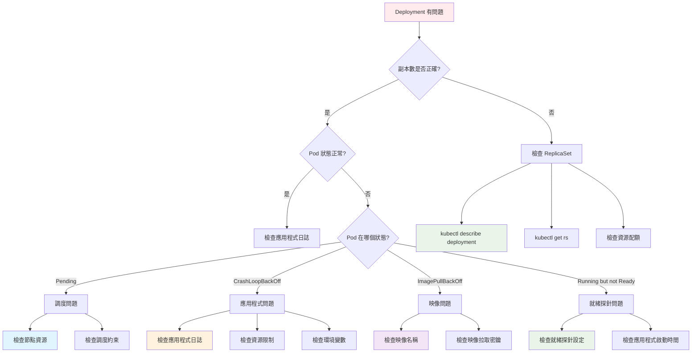

### 自動化監控告警

```yaml
# deployment-monitor-cronjob.yaml
apiVersion: batch/v1
kind: CronJob
metadata:
name: deployment-monitor
spec:
schedule: "*/5 * * * *"  # 每 5 分鐘執行一次
jobTemplate:
  spec:
    template:
      spec:
        containers:
        - name: monitor
          image: bitnami/kubectl:latest
          command:
          - /bin/bash
          - -c
          - |
            # 檢查所有 Deployment
            for deployment in $(kubectl get deployments -o name); do
              name=$(echo $deployment | cut -d'/' -f2)
              desired=$(kubectl get $deployment -o jsonpath='{.spec.replicas}')
              ready=$(kubectl get $deployment -o jsonpath='{.status.readyReplicas}')
              
              if [[ "${ready:-0}" -ne "$desired" ]]; then
                echo "⚠️ ALERT: Deployment $name has ${ready:-0}/$desired ready replicas"
                kubectl describe deployment $name
              fi
            done
        restartPolicy: OnFailure
```

### 監控最佳實踐總結

```bash
# 日常監控檢查清單
□ kubectl get deployments -A                    # 檢查所有 Deployment
□ kubectl get deployments -o wide               # 查看詳細狀態
□ kubectl top pods                              # 檢查資源使用
□ kubectl get events --sort-by=.metadata.creationTimestamp | tail -10  # 最近事件
□ kubectl get pods --field-selector=status.phase!=Running  # 問題 Pod

# 每日監控腳本
#!/bin/bash
echo "=== 每日 Deployment 健康檢查 ==="
echo "日期: $(date)"
echo

# 檢查所有 Deployment 狀態
echo "=== Deployment 狀態總覽 ==="
kubectl get deployments -A -o custom-columns=\
NAMESPACE:.metadata.namespace,\
NAME:.metadata.name,\
READY:.status.readyReplicas/.spec.replicas,\
AVAILABLE:.status.availableReplicas,\
AGE:.metadata.creationTimestamp

echo

# 檢查問題 Pod
echo "=== 問題 Pod ==="
kubectl get pods -A --field-selector=status.phase!=Running,status.phase!=Succeeded

echo

# 檢查資源使用 TOP 10
echo "=== 資源使用 TOP 10 ==="
kubectl top pods -A --sort-by=memory | head -11

echo

# 檢查最近警告事件
echo "=== 最近警告事件 ==="
kubectl get events -A --field-selector type=Warning \
--sort-by=.metadata.creationTimestamp | tail -5
```

---

## 🎯 總結與最佳實踐

### ✅ 今日學習成果

通過今天的學習，你已經完全掌握了：

#### 🏗️ 核心概念
- **Deployment 三層架構**：Deployment → ReplicaSet → Pod
- **與 Docker Compose 的本質區別**：自動化 vs 手動管理
- **標籤選擇器機制**：如何精確管理 Pod 集合

#### 📝 YAML 配置精通
- **完整的 Deployment 規格**：從基礎到高級配置
- **更新策略對比**：RollingUpdate vs Recreate 的適用場景
- **資源管理和健康檢查**：生產級別的配置方法

#### 🔄 運維操作熟練
- **滾動更新和回滾**：零停機更新的完整流程
- **擴縮容管理**：動態調整應用規模
- **監控和診斷**：系統化的故障排除方法

### 🚀 Docker Compose 到 Kubernetes 的完整轉換

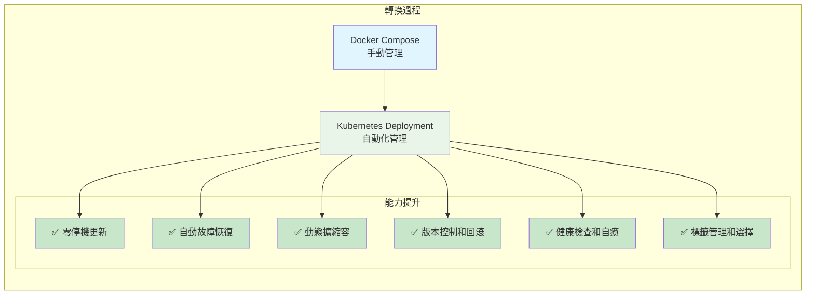

### 📋 Deployment 最佳實踐檢查清單

#### ✅ 配置最佳實踐
```yaml
# 生產級 Deployment 模板
apiVersion: apps/v1
kind: Deployment
metadata:
name: app-production
labels:
  app.kubernetes.io/name: app
  app.kubernetes.io/instance: production
  app.kubernetes.io/version: "v1.0.0"
spec:
# 副本和更新策略
replicas: 3
strategy:
  type: RollingUpdate
  rollingUpdate:
    maxUnavailable: 1
    maxSurge: 1

# 標籤選擇器
selector:
  matchLabels:
    app.kubernetes.io/name: app
    app.kubernetes.io/instance: production

template:
  metadata:
    labels:
      app.kubernetes.io/name: app
      app.kubernetes.io/instance: production
      app.kubernetes.io/version: "v1.0.0"
  spec:
    containers:
    - name: app
      image: app:v1.0.0
      
      # 資源管理
      resources:
        requests:
          memory: "128Mi"
          cpu: "100m"
        limits:
          memory: "256Mi"
          cpu: "200m"
      
      # 健康檢查
      livenessProbe:
        httpGet:
          path: /health
          port: 8080
        initialDelaySeconds: 30
        periodSeconds: 10
      
      readinessProbe:
        httpGet:
          path: /ready
          port: 8080
        initialDelaySeconds: 5
        periodSeconds: 5
      
      # 優雅關閉
      lifecycle:
        preStop:
          exec:
            command: ["/bin/sh", "-c", "sleep 10"]
    
    terminationGracePeriodSeconds: 30
```

#### ✅ 運維最佳實踐
```bash
# 1. 部署前檢查
□ 驗證 YAML 語法: kubectl apply --dry-run=client -f deployment.yaml
□ 檢查資源配額: kubectl describe quota
□ 驗證映像存在: docker pull <image>

# 2. 部署過程監控
□ 實時監控: kubectl rollout status deployment/app-name
□ 檢查 Pod 狀態: kubectl get pods -l app=app-name -w
□ 監控事件: kubectl get events -w

# 3. 部署後驗證
□ 檢查副本狀態: kubectl get deployment app-name
□ 驗證應用功能: kubectl port-forward deployment/app-name 8080:8080
□ 檢查日誌: kubectl logs -l app=app-name

# 4. 日常維護
□ 定期檢查資源使用: kubectl top pods
□ 監控重啟次數: kubectl get pods -o wide
□ 清理舊 ReplicaSet: kubectl delete rs --cascade=false <old-rs>
```

### 🔧 常用命令速查表

```bash
# ============ 創建和管理 ============
kubectl create deployment nginx --image=nginx:1.21 --replicas=3
kubectl apply -f deployment.yaml
kubectl delete deployment nginx

# ============ 擴縮容 ============
kubectl scale deployment nginx --replicas=5
kubectl autoscale deployment nginx --min=2 --max=10 --cpu-percent=80

# ============ 更新和回滾 ============
kubectl set image deployment/nginx nginx=nginx:1.22
kubectl rollout status deployment/nginx
kubectl rollout history deployment/nginx
kubectl rollout undo deployment/nginx
kubectl rollout undo deployment/nginx --to-revision=2

# ============ 監控和診斷 ============
kubectl get deployments -o wide
kubectl describe deployment nginx
kubectl get pods -l app=nginx
kubectl logs -l app=nginx
kubectl top pods -l app=nginx

# ============ 標籤管理 ============
kubectl get pods --show-labels
kubectl label deployment nginx environment=production
kubectl get deployments -l environment=production
```

