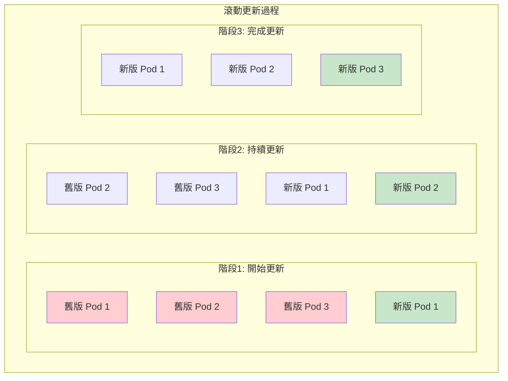
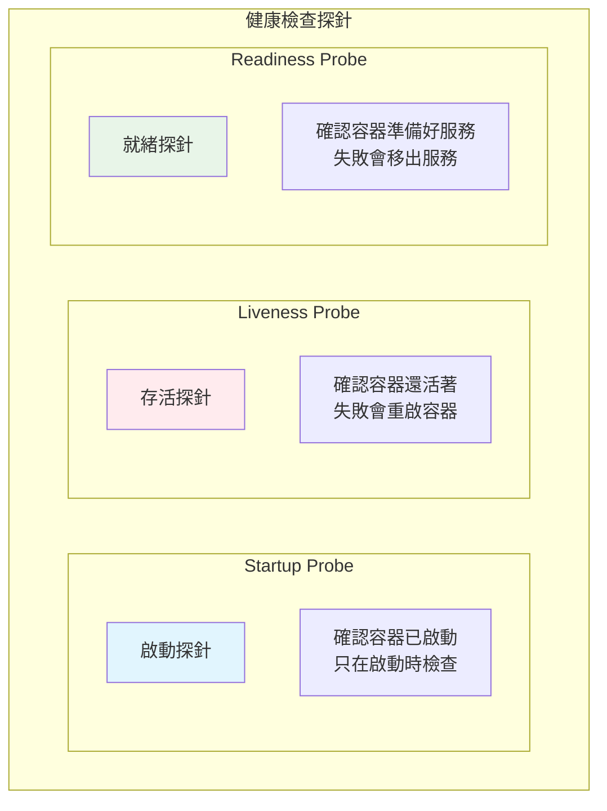
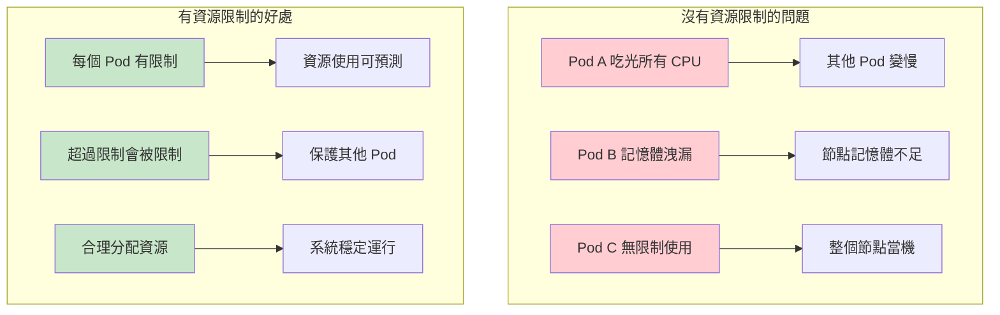

Kubernetes 學習 - Day 5: Deployment 進階管理
📚 今日學習目標
深入掌握 Deployment 的進階功能與最佳實踐

🎯 學習成果
✅ 掌握滾動更新策略的配置與控制
✅ 學會健康檢查探針的設定
✅ 理解資源限制與請求的重要性
✅ 熟悉版本管理與回滾操作
✅ 掌握故障排除的技巧


🔄 滾動更新策略深入
什麼是滾動更新？
想像你要更換餐廳的所有服務員制服：

傳統方式：所有人同時換衣服 → 餐廳暫停營業 😰
滾動更新：一個一個換 → 餐廳持續營業 ✅




滾動更新策略配置
```yaml
# advanced-deployment.yaml
apiVersion: apps/v1
kind: Deployment
metadata:
  name: nginx-advanced
spec:
  replicas: 6
  selector:
    matchLabels:
      app: nginx-advanced
  
  # 滾動更新策略
  strategy:
    type: RollingUpdate
    rollingUpdate:
      maxUnavailable: 2        # 最多 2 個 Pod 不可用 (33%)
      maxSurge: 2             # 最多多出 2 個 Pod (33%)
  
  template:
    metadata:
      labels:
        app: nginx-advanced
    spec:
      containers:
      - name: nginx
        image: nginx:1.20
        ports:
        - containerPort: 80
```

更新策略參數說明
參數	說明	範例	適用場景
maxUnavailable	更新時最多幾個 Pod 不可用	1 或 25%	高可用性要求
maxSurge	更新時最多多出幾個 Pod	1 或 25%	資源充足時
type: Recreate	先刪除所有舊 Pod 再建新的	-	開發環境

實際更新操作
```bash
# 部署初始版本
kubectl apply -f advanced-deployment.yaml

# 觀察更新過程
kubectl rollout status deployment/nginx-advanced -w

# 更新映像檔並觀察過程
kubectl set image deployment/nginx-advanced nginx=nginx:1.21
kubectl get pods -w  # 觀察 Pod 變化

# 暫停更新
kubectl rollout pause deployment/nginx-advanced

# 恢復更新
kubectl rollout resume deployment/nginx-advanced
```

🏥 健康檢查探針
三種探針類型



健康檢查配置範例
```yaml
# health-check-deployment.yaml
apiVersion: apps/v1
kind: Deployment
metadata:
  name: webapp-with-health
spec:
  replicas: 3
  selector:
    matchLabels:
      app: webapp
  template:
    metadata:
      labels:
        app: webapp
    spec:
      containers:
      - name: webapp
        image: nginx:1.21
        ports:
        - containerPort: 80
        
        # 啟動探針 - 給應用足夠時間啟動
        startupProbe:
          httpGet:
            path: /
            port: 80
          initialDelaySeconds: 10    # 等待 10 秒開始檢查
          periodSeconds: 5           # 每 5 秒檢查一次
          failureThreshold: 6        # 失敗 6 次才算失敗
          timeoutSeconds: 3          # 每次檢查 3 秒超時
        
        # 存活探針 - 檢查容器是否還活著
        livenessProbe:
          httpGet:
            path: /
            port: 80
          initialDelaySeconds: 30    # 啟動後 30 秒開始檢查
          periodSeconds: 10          # 每 10 秒檢查一次
          failureThreshold: 3        # 連續失敗 3 次重啟
          timeoutSeconds: 5
        
        # 就緒探針 - 檢查是否準備好接收流量
        readinessProbe:
          httpGet:
            path: /
            port: 80
          initialDelaySeconds: 5     # 5 秒後開始檢查
          periodSeconds: 5           # 每 5 秒檢查一次
          failureThreshold: 3        # 失敗 3 次移出服務
          successThreshold: 1        # 成功 1 次加回服務
          timeoutSeconds: 3
```

不同探針檢查方式
```yaml
# 不同的健康檢查方式
containers:
- name: app
  image: myapp:1.0
  
  # HTTP 檢查
  livenessProbe:
    httpGet:
      path: /health
      port: 8080
      httpHeaders:
      - name: Custom-Header
        value: health-check
  
  # TCP 檢查
  readinessProbe:
    tcpSocket:
      port: 8080
  
  # 命令檢查
  startupProbe:
    exec:
      command:
      - cat
      - /app/ready
```

💾 資源管理與限制
為什麼需要資源限制？


資源配置範例
```yaml
# resource-limit-deployment.yaml
apiVersion: apps/v1
kind: Deployment
metadata:
  name: resource-managed-app
spec:
  replicas: 3
  selector:
    matchLabels:
      app: managed-app
  template:
    metadata:
      labels:
        app: managed-app
    spec:
      containers:
      - name: app
        image: nginx:1.21
        ports:
        - containerPort: 80
        
        # 資源請求和限制
        resources:
          requests:              # 最少需要的資源
            memory: "128Mi"      # 128 MB 記憶體
            cpu: "100m"          # 0.1 CPU 核心
          limits:                # 最多能用的資源
            memory: "256Mi"      # 256 MB 記憶體
            cpu: "200m"          # 0.2 CPU 核心
```

資源單位說明
資源類型	單位	說明	範例
CPU	m (毫核心)	1000m = 1 CPU 核心	100m = 0.1 核心
記憶體	Mi, Gi	二進位單位	128Mi = 128 MB
記憶體	M, G	十進位單位	128M = 128 MB


🔄 版本管理與回滾
查看更新歷史
```bash
# 查看 Deployment 更新歷史
kubectl rollout history deployment/nginx-advanced

# 查看特定版本詳情
kubectl rollout history deployment/nginx-advanced --revision=2

# 查看目前狀態
kubectl rollout status deployment/nginx-advanced
```

回滾操作
```bash
# 回滾到上一個版本
kubectl rollout undo deployment/nginx-advanced

# 回滾到指定版本
kubectl rollout undo deployment/nginx-advanced --to-revision=1

# 重新啟動 Deployment（重建所有 Pod）
kubectl rollout restart deployment/nginx-advanced
```

更新歷史管理
```yaml
# 在 Deployment 中設定保留歷史版本數
spec:
  revisionHistoryLimit: 5  # 保留最近 5 個版本
```


🔧 故障排除技巧
常見問題診斷
```bash
# 1. 檢查 Deployment 狀態
kubectl get deployment nginx-advanced
kubectl describe deployment nginx-advanced

# 2. 檢查 ReplicaSet
kubectl get replicaset
kubectl describe replicaset <replicaset-name>

# 3. 檢查 Pod 狀態
kubectl get pods -l app=nginx-advanced
kubectl describe pod <pod-name>

# 4. 查看日誌
kubectl logs <pod-name>
kubectl logs <pod-name> --previous  # 查看前一個容器的日誌

# 5. 進入容器除錯
kubectl exec -it <pod-name> -- /bin/bash
```


常見問題與解決方案
問題	症狀	解決方案
映像檔拉取失敗	ImagePullBackOff	檢查映像檔名稱和標籤
資源不足	Pending 狀態	調整資源請求或增加節點
健康檢查失敗	不斷重啟	調整探針參數或修復應用
更新卡住	Progressing	檢查新版本是否有問題


🧪 綜合實戰演練
建立生產級 Deployment
```yaml
# production-deployment.yaml
apiVersion: apps/v1
kind: Deployment
metadata:
  name: production-app
  labels:
    app: production-app
    version: v1.0
spec:
  replicas: 5
  selector:
    matchLabels:
      app: production-app
  
  strategy:
    type: RollingUpdate
    rollingUpdate:
      maxUnavailable: 1
      maxSurge: 1
  
  template:
    metadata:
      labels:
        app: production-app
        version: v1.0
    spec:
      containers:
      - name: app
        image: nginx:1.21
        ports:
        - containerPort: 80
          name: http
        
        resources:
          requests:
            memory: "128Mi"
            cpu: "100m"
          limits:
            memory: "256Mi"
            cpu: "200m"
        
        startupProbe:
          httpGet:
            path: /
            port: 80
          initialDelaySeconds: 10
          periodSeconds: 5
          failureThreshold: 6
        
        livenessProbe:
          httpGet:
            path: /
            port: 80
          initialDelaySeconds: 30
          periodSeconds: 10
          failureThreshold: 3
        
        readinessProbe:
          httpGet:
            path: /
            port: 80
          initialDelaySeconds: 5
          periodSeconds: 5
          failureThreshold: 3
        
        env:
        - name: ENV
          value: "production"
```

完整測試流程
```bash
# 1. 部署應用
kubectl apply -f production-deployment.yaml

# 2. 觀察部署過程
kubectl rollout status deployment/production-app

# 3. 測試擴縮容
kubectl scale deployment production-app --replicas=8
kubectl get pods -w

# 4. 測試滾動更新
kubectl set image deployment/production-app app=nginx:1.22
kubectl rollout status deployment/production-app

# 5. 測試回滾
kubectl rollout undo deployment/production-app

# 6. 清理資源
kubectl delete deployment production-app
```


🎯 今日重點回顧
核心概念
滾動更新：零停機更新應用
健康檢查：確保應用正常運行
資源管理：合理分配系統資源
版本控制：安全的更新和回滾
最佳實踐
總是設定資源限制
配置適當的健康檢查
使用滾動更新策略
保留適當的歷史版本
在生產環境前充分測試
必記指令
```bash
kubectl rollout status deployment/<name>    # 查看更新狀態
kubectl rollout undo deployment/<name>      # 回滾
kubectl rollout history deployment/<name>   # 查看歷史
kubectl scale deployment <name> --replicas=<數量>  # 擴縮容

```