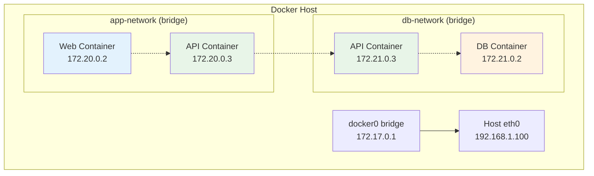
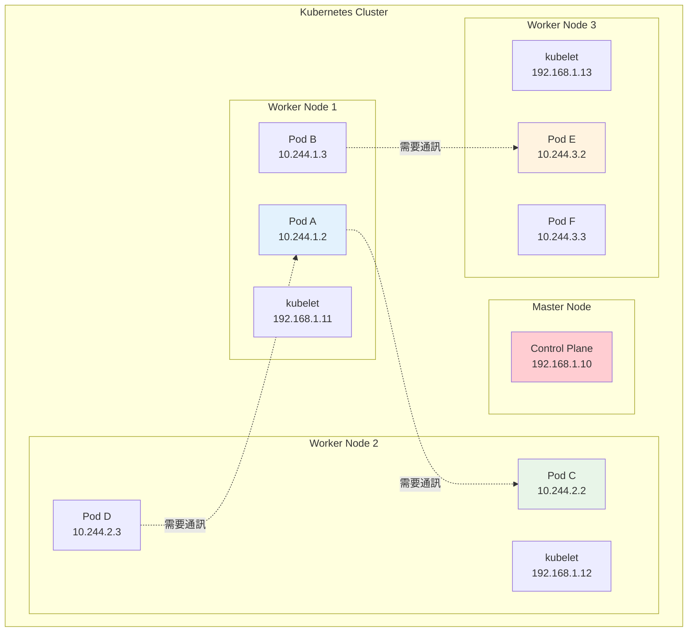
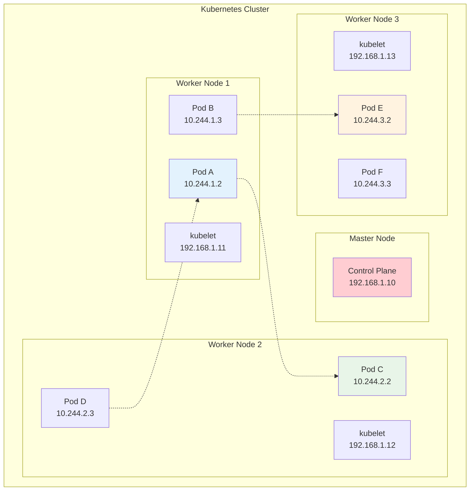
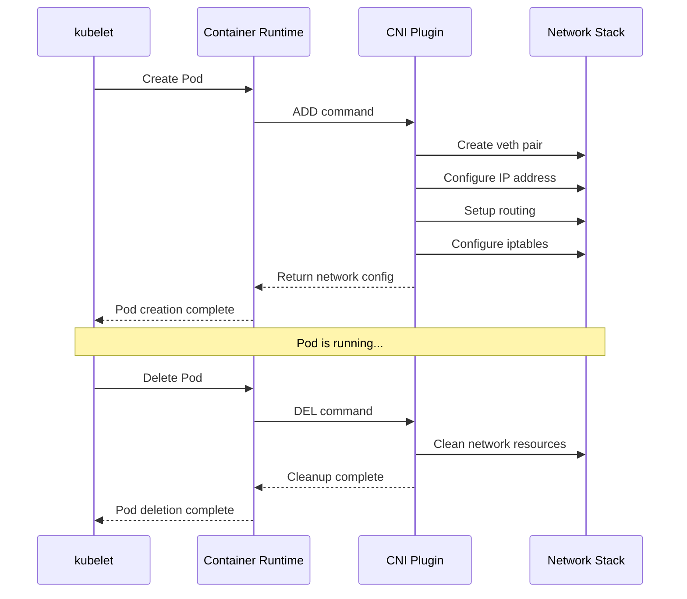
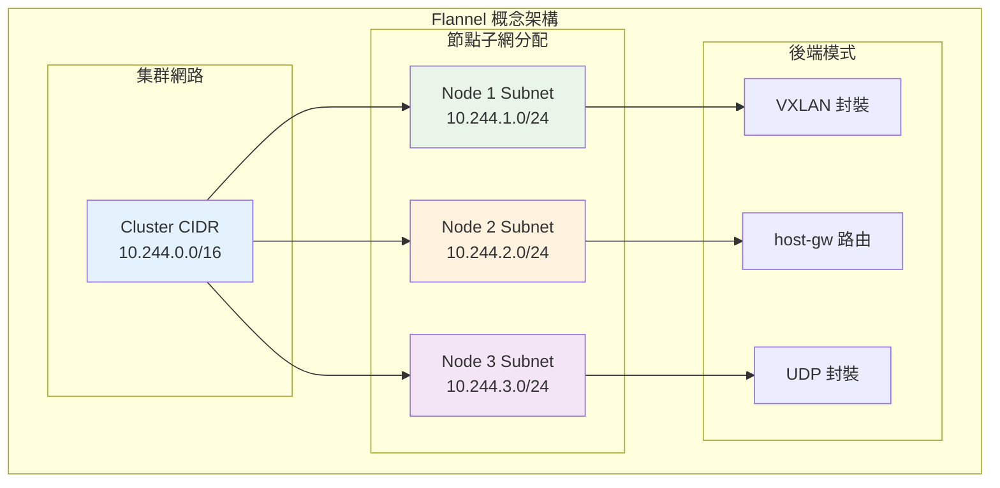
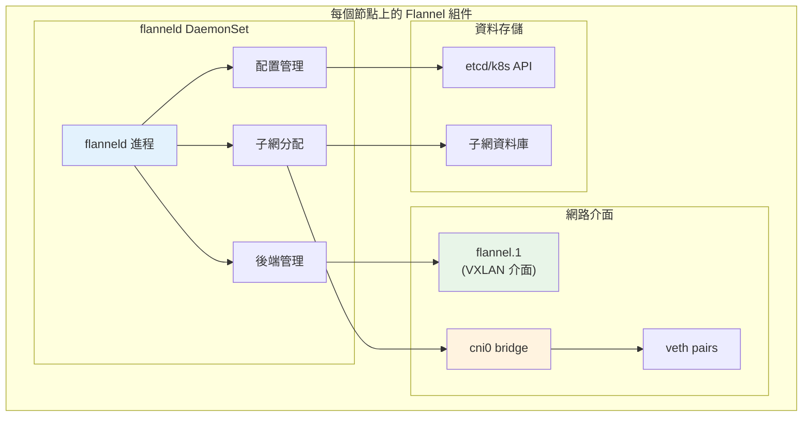
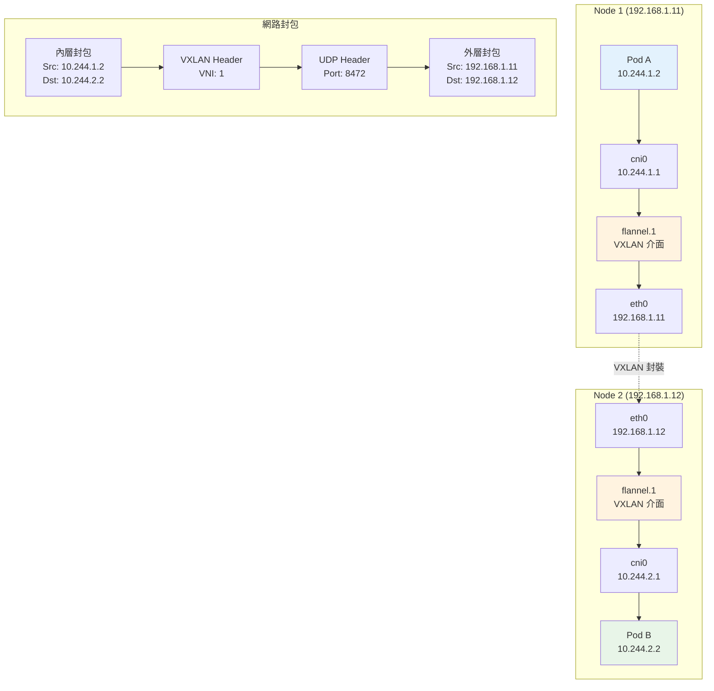
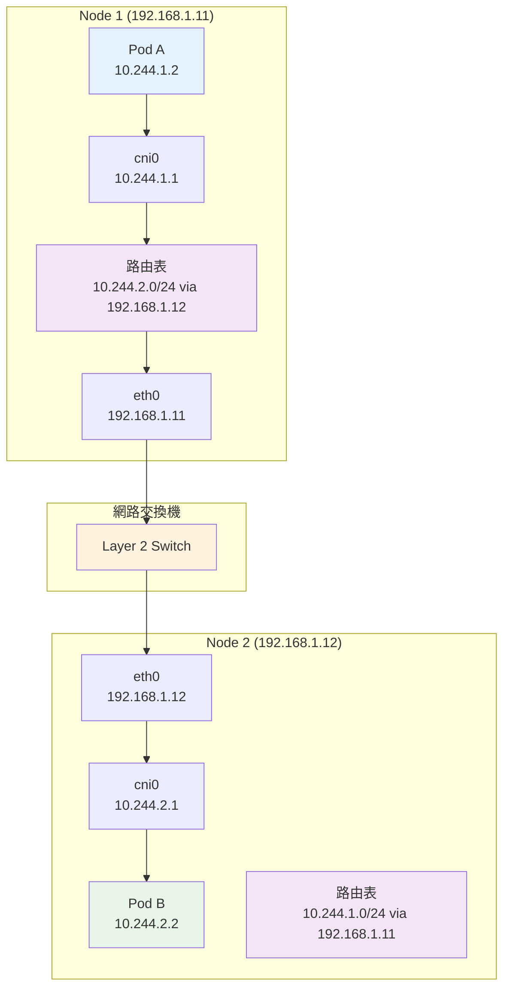

# Kubernetes 學習 - Day 8: Flannel CNI 網路深入解析

## 📚 學習目標

今天我們將深入了解 Kubernetes 的網路核心 - CNI (Container Network Interface)，並專注於 Flannel CNI 的工作原理。我們會從 Docker Compose 的網路概念出發，逐步理解 Kubernetes 的網路模型。

### 🎯 學習重點
- 理解 CNI 的概念與架構
- 掌握 Flannel CNI 的工作原理
- 分析網路封包流向
- 比較不同後端模式
- 實作自訂 KinD 叢集並測試網路通訊

---

## 🔍 從 Docker Compose 到 Kubernetes 網路

### Docker Compose 網路回顧

在 Docker Compose 中，網路相對簡單：

```yaml
# docker-compose.yml
version: '3.8'
services:
  web:
    image: nginx
    networks:
      - app-network
  
  api:
    image: node:14
    networks:
      - app-network
  
  db:
    image: postgres
    networks:
      - db-network

networks:
  app-network:
    driver: bridge
  db-network:
    driver: bridge
```

### Docker Compose 網路架構圖



### Docker Compose 網路特點

✅ **優點**：
- 簡單易用，自動 DNS 解析
- 容器間可直接通過服務名通訊
- 網路隔離性好

❌ **限制**：
- 只能在單一主機上運行
- 無法跨主機通訊
- 擴展性有限

---

## 🌐 Kubernetes 網路挑戰

當我們從單機的 Docker Compose 轉移到多節點的 Kubernetes 時，面臨的網路挑戰：

### 多節點網路需求



### Kubernetes 網路需求

Kubernetes 網路模型要求：

1. **每個 Pod 都有唯一的 IP 地址**
2. **Pod 間可以直接通訊（無需 NAT）**
3. **Node 與 Pod 間可以直接通訊**
4. **Pod 看到的自己 IP 與其他 Pod 看到的一致**

---

## 🔌 CNI (Container Network Interface) 概念

### 什麼是 CNI？

CNI 是一個標準化的接口，用於配置 Linux 容器的網路。它定義了：

- **網路插件的標準接口**
- **配置格式規範**
- **執行時行為定義**

### CNI 架構圖



### CNI 工作流程



---

## 🌊 Flannel CNI 深入解析

### Flannel 是什麼？

Flannel 是 CoreOS 開發的簡單易用的 CNI 插件，專為 Kubernetes 設計。

**設計理念**：
- 簡單性優於複雜性
- 為每個節點分配一個子網段
- 通過封裝技術實現跨節點通訊

### Flannel 核心概念



### Flannel 組件架構



---

## 📦 Flannel 後端模式詳解

### 1. VXLAN 模式（預設）

**特點**：使用 VXLAN 隧道技術，在 UDP 封包中封裝原始的乙太網路幀。



**VXLAN 封包結構**：
```
+------------------+
| 外層 Ethernet    |
+------------------+
| 外層 IP Header   |
+------------------+
| UDP Header       |
+------------------+
| VXLAN Header     |
+------------------+
| 內層 Ethernet    |
+------------------+
| 內層 IP Header   |
+------------------+
| 應用資料         |
+------------------+
```

### 2. host-gw 模式

**特點**：使用主機路由表，直接路由而不封裝。



**host-gw 路由表範例**：
```bash
# Node 1 路由表
10.244.1.0/24 dev cni0 proto kernel scope link src 10.244.1.1
10.244.2.0/24 via 192.168.1.12 dev eth0
10.244.3.0/24 via 192.168.1.13 dev eth0
```

### 3. UDP 模式（已棄用）

**特點**：使用用戶空間的 UDP 封裝，性能較差。

### 後端模式比較表

| 特性 | VXLAN | host-gw | UDP |
|------|-------|---------|-----|
| **封裝方式** | 內核 VXLAN | 直接路由 | 用戶空間 UDP |
| **性能** | 中等 | 最佳 | 最差 |
| **網路要求** | 任意 | Layer 2 連通 | 任意 |
| **MTU 影響** | -50 bytes | 無影響 | -28 bytes |
| **複雜度** | 中等 | 簡單 | 複雜 |
| **推薦場景** | 通用場景 | 同網段節點 | 已棄用 |

---

## 🔬 實作 1：建立使用 Flannel CNI 的自訂 KinD 叢集

### 準備 KinD 配置文件

```yaml
# kind-flannel-config.yaml
kind: Cluster
apiVersion: kind.x-k8s.io/v1alpha4
name: flannel-cluster

# 網路配置
networking:
  # 禁用預設 CNI，我們要手動安裝 Flannel
  disableDefaultCNI: true
  # Pod 子網範圍
  podSubnet: "10.244.0.0/16"
  # Service 子網範圍
  serviceSubnet: "10.96.0.0/12"

# 節點配置
nodes:
# Control plane 節點
- role: control-plane
  image: kindest/node:v1.28.0
  kubeadmConfigPatches:
  - |
    kind: InitConfiguration
    nodeRegistration:
      kubeletExtraArgs:
        node-labels: "node-type=control-plane"
  - |
    kind: ClusterConfiguration
    controllerManager:
      extraArgs:
        bind-address: "0.0.0.0"
    scheduler:
      extraArgs:
        bind-address: "0.0.0.0"
    etcd:
      local:
        extraArgs:
          listen-metrics-urls: "http://0.0.0.0:2381"
  
  # 端口映射，方便測試
  extraPortMappings:
  - containerPort: 30080
    hostPort: 30080
    protocol: TCP
  - containerPort: 30443
    hostPort: 30443
    protocol: TCP

# Worker 節點 1
- role: worker
  image: kindest/node:v1.28.0
  kubeadmConfigPatches:
  - |
    kind: JoinConfiguration
    nodeRegistration:
      kubeletExtraArgs:
        node-labels: "node-type=worker,zone=zone-a"

# Worker 節點 2
- role: worker
  image: kindest/node:v1.28.0
  kubeadmConfigPatches:
  - |
    kind: JoinConfiguration
    nodeRegistration:
      kubeletExtraArgs:
        node-labels: "node-type=worker,zone=zone-b"

# Worker 節點 3
- role: worker
  image: kindest/node:v1.28.0
  kubeadmConfigPatches:
  - |
    kind: JoinConfiguration
    nodeRegistration:
      kubeletExtraArgs:
        node-labels: "node-type=worker,zone=zone-c"
```

### 建立叢集腳本

```bash
#!/bin/bash
# setup-flannel-cluster.sh

set -e

echo "🚀 建立 Flannel CNI 測試叢集"

# 1. 檢查必要工具
echo "🔍 檢查必要工具..."

if ! command -v kind &> /dev/null; then
    echo "❌ KinD 未安裝，請先安裝 KinD"
    exit 1
fi

if ! command -v kubectl &> /dev/null; then
    echo "❌ kubectl 未安裝，請先安裝 kubectl"
    exit 1
fi

if ! command -v docker &> /dev/null; then
    echo "❌ Docker 未安裝，請先安裝 Docker"
    exit 1
fi

echo "✅ 所有必要工具已安裝"

# 2. 刪除現有叢集（如果存在）
echo "🗑️  清理現有叢集..."
kind delete cluster --name flannel-cluster 2>/dev/null || true

# 3. 建立新叢集
echo "🏗️  建立 KinD 叢集..."
kind create cluster --config kind-flannel-config.yaml --wait 300s

# 4. 等待節點就緒（但 CNI 尚未安裝，所以會是 NotReady）
echo "⏳ 等待節點啟動..."
sleep 30

# 5. 檢查節點狀態
echo "📊 檢查節點狀態（CNI 未安裝前）："
kubectl get nodes -o wide

echo "📋 檢查節點詳細資訊："
kubectl describe nodes | grep -E "(Name:|Taints:|Conditions:)" -A 5

# 6. 檢查 Pod 狀態（應該都是 Pending）
echo "📦 檢查系統 Pod 狀態（CNI 未安裝前）："
kubectl get pods -A -o wide

# 7. 下載 Flannel 配置
echo "📥 下載 Flannel 配置文件..."
curl -s https://raw.githubusercontent.com/flannel-io/flannel/master/Documentation/kube-flannel.yml > kube-flannel.yml

# 8. 修改 Flannel 配置以符合我們的網路設定
echo "⚙️  調整 Flannel 配置..."

# 備份原始配置
cp kube-flannel.yml kube-flannel-original.yml

# 修改網路配置
sed -i 's|"Network": "10.244.0.0/16"|"Network": "10.244.0.0/16"|g' kube-flannel.yml
sed -i 's|"Backend": {"Type": "vxlan"}|"Backend": {"Type": "vxlan", "Port": 8472}|g' kube-flannel.yml

# 9. 安裝 Flannel CNI
echo "🌐 安裝 Flannel CNI..."
kubectl apply -f kube-flannel.yml

# 10. 等待 Flannel Pod 就緒
echo "⏳ 等待 Flannel Pod 就緒..."
kubectl wait --for=condition=ready pod -l app=flannel -n kube-flannel --timeout=300s

# 11. 等待所有節點就緒
echo "⏳ 等待所有節點就緒..."
kubectl wait --for=condition=ready nodes --all --timeout=300s

# 12. 檢查最終狀態
echo "✅ 叢集建立完成！"
echo ""
echo "📊 最終節點狀態："
kubectl get nodes -o wide

echo ""
echo "📦 系統 Pod 狀態："
kubectl get pods -A -o wide

echo ""
echo "🌐 Flannel Pod 狀態："
kubectl get pods -n kube-flannel -o wide

echo ""
echo "🔍 網路配置檢查："
echo "Pod CIDR: $(kubectl cluster-info dump | grep -o 'cluster-cidr=[^"]*' | head -1)"
echo "Service CIDR: $(kubectl cluster-info dump | grep -o 'service-cluster-ip-range=[^"]*' | head -1)"

# 13. 顯示有用的命令
echo ""
echo "🎯 有用的命令："
echo "查看節點：kubectl get nodes -o wide"
echo "查看 Flannel 配置：kubectl get configmap kube-flannel-cfg -n kube-flannel -o yaml"
echo "查看 Flannel 日誌：kubectl logs -n kube-flannel -l app=flannel"
echo "進入節點：docker exec -it flannel-cluster-control-plane bash"
echo "刪除叢集：kind delete cluster --name flannel-cluster"

echo ""
echo "🎉 Flannel CNI 叢集建立完成！"
```

### 執行建立叢集

```bash
# 給腳本執行權限
chmod +x setup-flannel-cluster.sh

# 執行腳本
./setup-flannel-cluster.sh
```

---

        cat > /usr/share/nginx/html/index.html << EOF
        <!DOCTYPE html>
        <html>
        <head>
            <title>Network Test - Zone B</title>
            <style>
                body { font-family: Arial, sans-serif; margin: 40px; background: #e8f5e8; }
                .info { background: white; padding: 20px; border-radius: 8px; box-shadow: 0 2px 4px rgba(0,0,0,0.1); }
                .highlight { color: #388e3c; font-weight: bold; }
            </style>
        </head>
        <body>
            <div class="info">
                <h1>🌐 Network Test Pod - Zone B</h1>
                <p><strong>Pod Name:</strong> <span class="highlight">\$POD_NAME</span></p>
                <p><strong>Node Name:</strong> <span class="highlight">\$NODE_NAME</span></p>
                <p><strong>Pod IP:</strong> <span class="highlight">\$POD_IP</span></p>
                <p><strong>Zone:</strong> <span class="highlight">zone-b</span></p>
                <p><strong>Timestamp:</strong> <span class="highlight">\$(date)</span></p>
                <hr>
                <h3>Network Information:</h3>
                <pre>\$(ip addr show eth0)</pre>
                <hr>
                <h3>Routing Table:</h3>
                <pre>\$(ip route)</pre>
            </div>
        </body>
        </html>
        EOF
        
        nginx -g "daemon off;"
      resources:
        requests:
          memory: "64Mi"
          cpu: "50m"
        limits:
          memory: "128Mi"
          cpu: "100m"

---
apiVersion: apps/v1
kind: Deployment
metadata:
name: test-app-zone-c
namespace: network-test
labels:
  app: test-app
  zone: zone-c
spec:
replicas: 2
selector:
  matchLabels:
    app: test-app
    zone: zone-c
template:
  metadata:
    labels:
      app: test-app
      zone: zone-c
  spec:
    nodeSelector:
      zone: zone-c
    containers:
    - name: test-container
      image: nginx:1.21-alpine
      ports:
      - containerPort: 80
      env:
      - name: NODE_NAME
        valueFrom:
          fieldRef:
            fieldPath: spec.nodeName
      - name: POD_NAME
        valueFrom:
          fieldRef:
            fieldPath: metadata.name
      - name: POD_IP
        valueFrom:
          fieldRef:
            fieldPath: status.podIP
      command: ["/bin/sh", "-c"]
      args:
      - |
        cat > /usr/share/nginx/html/index.html << EOF
        <!DOCTYPE html>
        <html>
        <head>
            <title>Network Test - Zone C</title>
            <style>
                body { font-family: Arial, sans-serif; margin: 40px; background: #fff3e0; }
                .info { background: white; padding: 20px; border-radius: 8px; box-shadow: 0 2px 4px rgba(0,0,0,0.1); }
                .highlight { color: #f57c00; font-weight: bold; }
            </style>
        </head>
        <body>
            <div class="info">
                <h1>🌐 Network Test Pod - Zone C</h1>
                <p><strong>Pod Name:</strong> <span class="highlight">\$POD_NAME</span></p>
                <p><strong>Node Name:</strong> <span class="highlight">\$NODE_NAME</span></p>
                <p><strong>Pod IP:</strong> <span class="highlight">\$POD_IP</span></p>
                <p><strong>Zone:</strong> <span class="highlight">zone-c</span></p>
                <p><strong>Timestamp:</strong> <span class="highlight">\$(date)</span></p>
                <hr>
                <h3>Network Information:</h3>
                <pre>\$(ip addr show eth0)</pre>
                <hr>
                <h3>Routing Table:</h3>
                <pre>\$(ip route)</pre>
            </div>
        </body>
        </html>
        EOF
        
        nginx -g "daemon off;"
      resources:
        requests:
          memory: "64Mi"
          cpu: "50m"
        limits:
          memory: "128Mi"
          cpu: "100m"

---
# 網路測試工具 Pod
```yaml
apiVersion: apps/v1
kind: Deployment
metadata:
name: network-debug-tools
namespace: network-test
labels:
  app: network-debug
spec:
replicas: 1
selector:
  matchLabels:
    app: network-debug
template:
  metadata:
    labels:
      app: network-debug
  spec:
    containers:
    - name: debug-tools
      image: nicolaka/netshoot:latest
      command: ["/bin/bash", "-c", "sleep infinity"]
      env:
      - name: NODE_NAME
        valueFrom:
          fieldRef:
            fieldPath: spec.nodeName
      - name: POD_NAME
        valueFrom:
          fieldRef:
            fieldPath: metadata.name
      - name: POD_IP
        valueFrom:
          fieldRef:
            fieldPath: status.podIP
      resources:
        requests:
          memory: "128Mi"
          cpu: "100m"
        limits:
          memory: "256Mi"
          cpu: "200m"
```

---
# 為測試應用創建 Service
```yaml
apiVersion: v1
kind: Service
metadata:
name: test-app-zone-a-service
namespace: network-test
labels:
  zone: zone-a
spec:
selector:
  app: test-app
  zone: zone-a
ports:
- port: 80
  targetPort: 80
  name: http
type: ClusterIP

---
apiVersion: v1
kind: Service
metadata:
name: test-app-zone-b-service
namespace: network-test
labels:
  zone: zone-b
spec:
selector:
  app: test-app
  zone: zone-b
ports:
- port: 80
  targetPort: 80
  name: http
type: ClusterIP

---
apiVersion: v1
kind: Service
metadata:
name: test-app-zone-c-service
namespace: network-test
labels:
  zone: zone-c
spec:
selector:
  app: test-app
  zone: zone-c
ports:
- port: 80
  targetPort: 80
  name: http
type: ClusterIP

---
# 測試用的 NodePort Service
apiVersion: v1
kind: Service
metadata:
name: test-app-nodeport
namespace: network-test
labels:
  service-type: nodeport
spec:
selector:
  app: test-app
ports:
- port: 80
  targetPort: 80
  nodePort: 30080
  name: http
type: NodePort
```

### 網路通訊測試腳本

```bash
#!/bin/bash
# test-pod-networking.sh

set -e

echo "🧪 開始 Pod 間網路通訊測試"

# 1. 部署測試應用
echo "📦 部署測試應用..."
kubectl apply -f test-network-apps.yaml

# 2. 等待所有 Pod 就緒
echo "⏳ 等待 Pod 就緒..."
kubectl wait --for=condition=ready pod -l app=test-app -n network-test --timeout=300s
kubectl wait --for=condition=ready pod -l app=network-debug -n network-test --timeout=300s

# 3. 獲取 Pod 資訊
echo "📋 獲取 Pod 資訊..."
echo ""
echo "=== 所有測試 Pod ==="
kubectl get pods -n network-test -o wide

echo ""
echo "=== 節點分佈情況 ==="
kubectl get pods -n network-test -o custom-columns="NAME:.metadata.name,NODE:.spec.nodeName,POD_IP:.status.podIP,ZONE:.metadata.labels.zone"

# 4. 獲取 Service 資訊
echo ""
echo "=== Service 資訊 ==="
kubectl get services -n network-test -o wide

# 5. 獲取網路調試工具 Pod
DEBUG_POD=$(kubectl get pods -n network-test -l app=network-debug -o jsonpath='{.items[0].metadata.name}')
echo ""
echo "🔍 網路調試工具 Pod: $DEBUG_POD"

# 6. 測試同節點 Pod 間通訊
echo ""
echo "🔄 測試同節點 Pod 間通訊..."

# 獲取同一節點上的兩個 Pod
ZONE_A_PODS=($(kubectl get pods -n network-test -l zone=zone-a -o jsonpath='{.items[*].status.podIP}'))
if [ ${#ZONE_A_PODS[@]} -ge 2 ]; then
  echo "測試 Zone A 內部通訊: ${ZONE_A_PODS[0]} -> ${ZONE_A_PODS[1]}"
  kubectl exec -n network-test $DEBUG_POD -- curl -s --connect-timeout 5 http://${ZONE_A_PODS[1]} | grep -o '<h1>.*</h1>' || echo "❌ 連線失敗"
fi

# 7. 測試跨節點 Pod 間通訊
echo ""
echo "🌐 測試跨節點 Pod 間通訊..."

# 獲取不同節點的 Pod IP
ZONE_A_IP=$(kubectl get pods -n network-test -l zone=zone-a -o jsonpath='{.items[0].status.podIP}')
ZONE_B_IP=$(kubectl get pods -n network-test -l zone=zone-b -o jsonpath='{.items[0].status.podIP}')
ZONE_C_IP=$(kubectl get pods -n network-test -l zone=zone-c -o jsonpath='{.items[0].status.podIP}')

echo "Zone A Pod IP: $ZONE_A_IP"
echo "Zone B Pod IP: $ZONE_B_IP"
echo "Zone C Pod IP: $ZONE_C_IP"

echo ""
echo "測試 Zone A -> Zone B 通訊:"
kubectl exec -n network-test $DEBUG_POD -- curl -s --connect-timeout 5 http://$ZONE_B_IP | grep -o '<h1>.*</h1>' || echo "❌ 連線失敗"

echo ""
echo "測試 Zone A -> Zone C 通訊:"
kubectl exec -n network-test $DEBUG_POD -- curl -s --connect-timeout 5 http://$ZONE_C_IP | grep -o '<h1>.*</h1>' || echo "❌ 連線失敗"

echo ""
echo "測試 Zone B -> Zone C 通訊:"
kubectl exec -n network-test $DEBUG_POD -- curl -s --connect-timeout 5 http://$ZONE_C_IP | grep -o '<h1>.*</h1>' || echo "❌ 連線失敗"

# 8. 測試 Service 通訊
echo ""
echo "🔗 測試 Service 通訊..."

echo "測試 Zone A Service:"
kubectl exec -n network-test $DEBUG_POD -- curl -s --connect-timeout 5 http://test-app-zone-a-service.network-test.svc.cluster.local | grep -o '<h1>.*</h1>' || echo "❌ Service 連線失敗"

echo ""
echo "測試 Zone B Service:"
kubectl exec -n network-test $DEBUG_POD -- curl -s --connect-timeout 5 http://test-app-zone-b-service.network-test.svc.cluster.local | grep -o '<h1>.*</h1>' || echo "❌ Service 連線失敗"

echo ""
echo "測試 Zone C Service:"
kubectl exec -n network-test $DEBUG_POD -- curl -s --connect-timeout 5 http://test-app-zone-c-service.network-test.svc.cluster.local | grep -o '<h1>.*</h1>' || echo "❌ Service 連線失敗"

# 9. 測試 DNS 解析
echo ""
echo "🔍 測試 DNS 解析..."

echo "解析 Zone A Service:"
kubectl exec -n network-test $DEBUG_POD -- nslookup test-app-zone-a-service.network-test.svc.cluster.local

echo ""
echo "解析 Zone B Service:"
kubectl exec -n network-test $DEBUG_POD -- nslookup test-app-zone-b-service.network-test.svc.cluster.local

# 10. 測試 NodePort 服務
echo ""
echo "🌐 測試 NodePort 服務..."

# 獲取節點 IP
NODE_IPS=($(kubectl get nodes -o jsonpath='{.items[*].status.addresses[?(@.type=="InternalIP")].address}'))
echo "節點 IP 列表: ${NODE_IPS[*]}"

for NODE_IP in "${NODE_IPS[@]}"; do
  echo "測試節點 $NODE_IP:30080"
  kubectl exec -n network-test $DEBUG_POD -- curl -s --connect-timeout 5 http://$NODE_IP:30080 | grep -o '<h1>.*</h1>' || echo "❌ NodePort 連線失敗"
done

# 11. 網路效能測試
echo ""
echo "⚡ 網路效能測試..."

echo "測試跨節點延遲 (Zone A -> Zone B):"
kubectl exec -n network-test $DEBUG_POD -- ping -c 3 $ZONE_B_IP

echo ""
echo "測試跨節點頻寬 (使用 iperf3):"
# 在 Zone B 啟動 iperf3 服務器
ZONE_B_POD=$(kubectl get pods -n network-test -l zone=zone-b -o jsonpath='{.items[0].metadata.name}')
kubectl exec -n network-test $ZONE_B_POD -- sh -c "iperf3 -s -D" &

sleep 2

# 從調試工具連接測試
kubectl exec -n network-test $DEBUG_POD -- iperf3 -c $ZONE_B_IP -t 10 -f M || echo "❌ iperf3 測試失敗"

echo ""
echo "✅ 網路通訊測試完成！"
```

### 執行測試

```bash
# 給腳本執行權限
chmod +x test-pod-networking.sh

# 執行測試
./test-pod-networking.sh
```

---

## 🔬 實作 3：分析 Flannel 網路行為

### Flannel 網路分析腳本

```bash
#!/bin/bash
# analyze-flannel-network.sh

set -e

echo "🔬 分析 Flannel 網路行為"

# 1. 檢查 Flannel 配置
echo "⚙️  檢查 Flannel 配置..."
echo ""
echo "=== Flannel ConfigMap ==="
kubectl get configmap kube-flannel-cfg -n kube-flannel -o yaml

echo ""
echo "=== Flannel DaemonSet ==="
kubectl get daemonset kube-flannel-ds -n kube-flannel -o wide

echo ""
echo "=== Flannel Pod 狀態 ==="
kubectl get pods -n kube-flannel -o wide

# 2. 檢查節點網路配置
echo ""
echo "🌐 檢查節點網路配置..."

NODES=($(kubectl get nodes -o jsonpath='{.items[*].metadata.name}'))

for NODE in "${NODES[@]}"; do
  echo ""
  echo "=== 節點: $NODE ==="
  
  echo "Node IP 和子網分配:"
  kubectl get node $NODE -o jsonpath='{.status.addresses[?(@.type=="InternalIP")].address}' && echo ""
  kubectl get node $NODE -o jsonpath='{.spec.podCIDR}' && echo ""
  
  echo ""
  echo "進入節點檢查網路介面:"
  docker exec $NODE ip addr show | grep -E "(flannel|cni|docker)" || true
  
  echo ""
  echo "檢查路由表:"
  docker exec $NODE ip route | grep -E "(10\.244|flannel)" || true
  
  echo ""
  echo "檢查 VXLAN 介面:"
  docker exec $NODE ip -d link show flannel.1 2>/dev/null || echo "VXLAN 介面不存在"
  
  echo ""
  echo "檢查 ARP 表:"
  docker exec $NODE ip neigh show dev flannel.1 2>/dev/null || echo "無 VXLAN ARP 條目"
done

# 3. 分析 Flannel 後端配置
echo ""
echo "🔍 分析 Flannel 後端配置..."

# 獲取 Flannel Pod
FLANNEL_POD=$(kubectl get pods -n kube-flannel -l app=flannel -o jsonpath='{.items[0].metadata.name}')

echo "Flannel Pod: $FLANNEL_POD"
echo ""
echo "Flannel 日誌 (最近 50 行):"
kubectl logs -n kube-flannel $FLANNEL_POD --tail=50

echo ""
echo "檢查 Flannel 子網分配:"
kubectl exec -n kube-flannel $FLANNEL_POD -- cat /run/flannel/subnet.env

# 4. 封包追蹤分析
echo ""
echo "📦 封包追蹤分析..."

# 獲取測試 Pod 資訊
if kubectl get namespace network-test &>/dev/null; then
  ZONE_A_POD=$(kubectl get pods -n network-test -l zone=zone-a -o jsonpath='{.items[0].metadata.name}')
  ZONE_B_POD=$(kubectl get pods -n network-test -l zone=zone-b -o jsonpath='{.items[0].metadata.name}')
  ZONE_A_IP=$(kubectl get pods -n network-test -l zone=zone-a -o jsonpath='{.items[0].status.podIP}')
  ZONE_B_IP=$(kubectl get pods -n network-test -l zone=zone-b -o jsonpath='{.items[0].status.podIP}')
  
  echo "Zone A Pod: $ZONE_A_POD ($ZONE_A_IP)"
  echo "Zone B Pod: $ZONE_B_POD ($ZONE_B_IP)"
  
  # 檢查 Pod 網路配置
  echo ""
  echo "Zone A Pod 網路配置:"
  kubectl exec -n network-test $ZONE_A_POD -- ip addr show eth0
  kubectl exec -n network-test $ZONE_A_POD -- ip route
  
  echo ""
  echo "Zone B Pod 網路配置:"
  kubectl exec -n network-test $ZONE_B_POD -- ip addr show eth0
  kubectl exec -n network-test $ZONE_B_POD -- ip route
  
  # 追蹤封包路徑
  echo ""
  echo "追蹤封包路徑 (Zone A -> Zone B):"
  kubectl exec -n network-test $ZONE_A_POD -- traceroute -n $ZONE_B_IP || echo "traceroute 不可用"
fi

# 5. 檢查 iptables 規則
echo ""
echo "🔥 檢查 iptables 規則..."

for NODE in "${NODES[@]}"; do
  echo ""
  echo "=== 節點 $NODE iptables 規則 ==="
  
  echo "NAT 表 (POSTROUTING):"
  docker exec $NODE iptables -t nat -L POSTROUTING -n | grep -E "(10\.244|flannel)" || echo "無相關規則"
  
  echo ""
  echo "Filter 表 (FORWARD):"
  docker exec $NODE iptables -t filter -L FORWARD -n | grep -E "(10\.244|flannel)" || echo "無相關規則"
done

# 6. 檢查 CNI 配置
echo ""
echo "🔌 檢查 CNI 配置..."

for NODE in "${NODES[@]}"; do
  echo ""
  echo "=== 節點 $NODE CNI 配置 ==="
  
  echo "CNI 配置文件:"
  docker exec $NODE ls -la /etc/cni/net.d/ || echo "CNI 配置目錄不存在"
  
  echo ""
  echo "Flannel CNI 配置:"
  docker exec $NODE cat /etc/cni/net.d/10-flannel.conflist 2>/dev/null || echo "Flannel CNI 配置不存在"
done

# 7. 網路性能分析
echo ""
echo "⚡ 網路性能分析..."

if kubectl get namespace network-test &>/dev/null; then
  DEBUG_POD=$(kubectl get pods -n network-test -l app=network-debug -o jsonpath='{.items[0].metadata.name}')
  
  echo "測試同節點通訊延遲:"
  kubectl exec -n network-test $DEBUG_POD -- ping -c 5 $ZONE_A_IP | tail -1
  
  echo ""
  echo "測試跨節點通訊延遲:"
  kubectl exec -n network-test $DEBUG_POD -- ping -c 5 $ZONE_B_IP | tail -1
  
  echo ""
  echo "檢查 MTU 設定:"
  kubectl exec -n network-test $DEBUG_POD -- ip link show eth0 | grep mtu
fi

# 8. Flannel 故障排除資訊
echo ""
echo "🩺 Flannel 故障排除資訊..."

echo "檢查 Flannel 健康狀態:"
kubectl get pods -n kube-flannel -o wide

echo ""
echo "檢查節點就緒狀態:"
kubectl get nodes -o wide

echo ""
echo "檢查系統 Pod 網路狀態:"
kubectl get pods -A -o wide | grep -E "(Pending|Error|CrashLoopBackOff)" || echo "所有 Pod 狀態正常"

echo ""
echo "✅ Flannel 網路分析完成！"

# 9. 生成網路拓撲圖資訊
echo ""
echo "🗺️  網路拓撲資訊..."

echo "節點和 Pod 分佈:"
kubectl get pods -A -o custom-columns="NAMESPACE:.metadata.namespace,NAME:.metadata.name,NODE:.spec.nodeName,POD_IP:.status.podIP" | grep -v "kube-system"

echo ""
echo "Service 和端點:"
kubectl get endpoints -A -o wide | grep -v "kube-system"
```

### 網路拓撲視覺化

```bash
#!/bin/bash
# generate-network-topology.sh

echo "🗺️  生成 Flannel 網路拓撲圖"

# 1. 收集網路資訊
echo "📊 收集網路資訊..."

# 創建輸出目錄
mkdir -p network-analysis

# 收集節點資訊
kubectl get nodes -o json > network-analysis/nodes.json
kubectl get pods -A -o json > network-analysis/pods.json
kubectl get services -A -o json > network-analysis/services.json

# 2. 生成拓撲資訊
cat > network-analysis/topology-info.txt << EOF
# Flannel 網路拓撲分析報告

## 叢集基本資訊
$(kubectl cluster-info)

## 節點資訊
$(kubectl get nodes -o wide)

## Flannel 配置
$(kubectl get configmap kube-flannel-cfg -n kube-flannel -o yaml)

## 子網分配
EOF

# 獲取每個節點的子網分配
NODES=($(kubectl get nodes -o jsonpath='{.items[*].metadata.name}'))
for NODE in "${NODES[@]}"; do
  echo "節點 $NODE:" >> network-analysis/topology-info.txt
  kubectl get node $NODE -o jsonpath='{.spec.podCIDR}' >> network-analysis/topology-info.txt
  echo "" >> network-analysis/topology-info.txt
done

# 3. 生成 Mermaid 圖表
cat > network-analysis/network-topology.md << 'EOF'
# Flannel 網路拓撲圖
```




```mermaid
graph TB
  subgraph "Kubernetes Cluster with Flannel CNI"
      subgraph "Control Plane"
          CP[Control Plane Node<br/>flannel-cluster-control-plane]
      end
      
      subgraph "Worker Nodes"
          subgraph "Worker Node 1"
              WN1[flannel-cluster-worker<br/>Zone A]
              WN1_SUBNET[Pod Subnet: 10.244.1.0/24]
              WN1_FLANNEL[flannel.1 VXLAN Interface]
              WN1_CNI[cni0 Bridge]
              
              subgraph "Pods on Node 1"
                  POD1A[test-app-zone-a-xxx<br/>10.244.1.2]
                  POD1B[test-app-zone-a-yyy<br/>10.244.1.3]
              end
          end
          
          subgraph "Worker Node 2"
              WN2[flannel-cluster-worker2<br/>Zone B]
              WN2_SUBNET[Pod Subnet: 10.244.2.0/24]
              WN2_FLANNEL[flannel.1 VXLAN Interface]
              WN2_CNI[cni0 Bridge]
              
              subgraph "Pods on Node 2"
                  POD2A[test-app-zone-b-xxx<br/>10.244.2.2]
                  POD2B[test-app-zone-b-yyy<br/>10.244.2.3]
              end
          end
          
          subgraph "Worker Node 3"
              WN3[flannel-cluster-worker3<br/>Zone C]
              WN3_SUBNET[Pod Subnet: 10.244.3.0/24]
              WN3_FLANNEL[flannel.1 VXLAN Interface]
              WN3_CNI[cni0 Bridge]
              
              subgraph "Pods on Node 3"
                  POD3A[test-app-zone-c-xxx<br/>10.244.3.2]
                  POD3B[network-debug-tools<br/>10.244.3.3]
              end
          end
      end
      
      subgraph "Flannel DaemonSet"
          FLANNEL_DS[kube-flannel-ds]
          FLANNEL_POD1[flannel-pod-1]
          FLANNEL_POD2[flannel-pod-2]
          FLANNEL_POD3[flannel-pod-3]
      end
      
      subgraph "Services"
          SVC_A[test-app-zone-a-service<br/>ClusterIP]
          SVC_B[test-app-zone-b-service<br/>ClusterIP]
          SVC_C[test-app-zone-c-service<br/>ClusterIP]
          SVC_NP[test-app-nodeport<br/>NodePort:30080]
      end
  end
  
  subgraph "Network Flow"
      VXLAN_TUNNEL[VXLAN Tunnel<br/>UDP Port 8472]
  end
  
  %% 連接關係
  POD1A --> WN1_CNI
  POD1B --> WN1_CNI
  WN1_CNI --> WN1_FLANNEL
  
  POD2A --> WN2_CNI
  POD2B --> WN2_CNI
  WN2_CNI --> WN2_FLANNEL
  
  POD3A --> WN3_CNI
  POD3B --> WN3_CNI
  WN3_CNI --> WN3_FLANNEL
  
  %% VXLAN 隧道
  WN1_FLANNEL -.->|VXLAN| VXLAN_TUNNEL
  WN2_FLANNEL -.->|VXLAN| VXLAN_TUNNEL
  WN3_FLANNEL -.->|VXLAN| VXLAN_TUNNEL
  
  %% Service 連接
  SVC_A --> POD1A
  SVC_A --> POD1B
  SVC_B --> POD2A
  SVC_B --> POD2B
  SVC_C --> POD3A
  
  SVC_NP --> POD1A
  SVC_NP --> POD1B
  SVC_NP --> POD2A
  SVC_NP --> POD2B
  SVC_NP --> POD3A
  
  %% Flannel DaemonSet
  FLANNEL_DS --> FLANNEL_POD1
  FLANNEL_DS --> FLANNEL_POD2
  FLANNEL_DS --> FLANNEL_POD3
  
  FLANNEL_POD1 --> WN1_FLANNEL
  FLANNEL_POD2 --> WN2_FLANNEL
  FLANNEL_POD3 --> WN3_FLANNEL
  
%% 樣式
style CP fill:#ffcdd2
style WN1 fill:#e3f2fd
style WN2 fill:#e8f5e8
style WN3 fill:#fff3e0
style POD1A fill:#bbdefb
style POD1B fill:#bbdefb
style POD2A fill:#c8e6c9
style POD2B fill:#c8e6c9
style POD3A fill:#ffe0b2
style POD3B fill:#ffe0b2
style VXLAN_TUNNEL fill:#f3e5f5
```

# 4. 生成詳細的網路分析報告
cat > network-analysis/detailed-analysis.md << 'EOF'
# Flannel CNI 詳細網路分析報告

## 1. 網路架構概覽

### 叢集網路配置
- **Pod CIDR**: 10.244.0.0/16
- **Service CIDR**: 10.96.0.0/12
- **CNI Plugin**: Flannel
- **Backend Mode**: VXLAN (預設)

### 節點子網分配


# 添加實際的節點子網資訊
```
for NODE in "${NODES[@]}"; do
  SUBNET=$(kubectl get node $NODE -o jsonpath='{.spec.podCIDR}')
  echo "- **$NODE**: $SUBNET" >> network-analysis/detailed-analysis.md
done

cat >> network-analysis/detailed-analysis.md << 'EOF'
```

## 2. Flannel VXLAN 工作原理

### VXLAN 封裝流程

1. **Pod A (10.244.1.2)** 發送封包到 **Pod B (10.244.2.2)**
2. 封包通過 **veth pair** 到達 **cni0 bridge**
3. **cni0** 根據路由表轉發到 **flannel.1** VXLAN 介面
4. **flannel.1** 將原始封包封裝在 VXLAN header 中
5. 外層使用節點 IP 進行路由 (192.168.x.x)
6. 目標節點的 **flannel.1** 解封裝並轉發到目標 Pod

### 封包結構分析

```
原始封包: [Eth][IP: 10.244.1.2 -> 10.244.2.2][TCP][Data]
                   ↓ VXLAN 封裝
VXLAN封包: [Eth][IP: 192.168.1.11 -> 192.168.1.12][UDP:8472][VXLAN][原始封包]
```

## 3. 網路介面分析

### 每個節點的網路介面

#### Control Plane 節點
- **eth0**: 節點主要網路介面 (192.168.x.x)
- **flannel.1**: VXLAN 介面 (10.244.0.0)
- **cni0**: Pod 網路橋接器 (10.244.0.1)

#### Worker 節點
- **eth0**: 節點主要網路介面
- **flannel.1**: VXLAN 介面
- **cni0**: Pod 網路橋接器
- **vethXXX**: Pod 的 veth pair 介面

## 4. 路由表分析

### 典型的節點路由表

```bash
# 節點內部 Pod 子網
10.244.1.0/24 dev cni0 proto kernel scope link src 10.244.1.1

# 其他節點的 Pod 子網 (通過 VXLAN)
10.244.2.0/24 via 10.244.2.0 dev flannel.1 onlink
10.244.3.0/24 via 10.244.3.0 dev flannel.1 onlink

# 預設路由
default via 192.168.65.1 dev eth0
```

## 5. Service 網路分析

### ClusterIP Service 工作原理

1. **kube-proxy** 監聽 Service 變化
2. 在每個節點創建 **iptables** 規則
3. 封包到達 Service IP 時被 **DNAT** 到後端 Pod IP
4. 使用 Flannel 網路進行 Pod 間通訊

### iptables 規則範例

```bash
# DNAT 規則 (Service -> Pod)
-A KUBE-SERVICES -d 10.96.1.100/32 -p tcp -m tcp --dport 80 -j KUBE-SVC-XXX

# 負載平衡規則
-A KUBE-SVC-XXX -m statistic --mode random --probability 0.5 -j KUBE-SEP-POD1
-A KUBE-SVC-XXX -j KUBE-SEP-POD2

# Pod 端點規則
-A KUBE-SEP-POD1 -p tcp -m tcp -j DNAT --to-destination 10.244.1.2:80
-A KUBE-SEP-POD2 -p tcp -m tcp -j DNAT --to-destination 10.244.2.2:80
```

## 6. 網路性能考量

### VXLAN 開銷

- **MTU 減少**: 原始 1500 bytes -> 1450 bytes (VXLAN header 50 bytes)
- **CPU 開銷**: 封裝/解封裝需要額外 CPU 資源
- **延遲增加**: 約 0.1-0.5ms 額外延遲

### 優化建議

1. **調整 MTU**: 在支援的環境中使用 Jumbo Frames
2. **考慮 host-gw**: 在 Layer 2 連通的環境中使用 host-gw 模式
3. **監控網路**: 使用 Prometheus + Grafana 監控網路指標

## 7. 故障排除指南

### 常見問題

#### Pod 無法通訊
1. 檢查 Flannel Pod 狀態
2. 確認節點子網分配
3. 檢查 VXLAN 介面狀態
4. 驗證路由表配置

#### 網路性能問題
1. 檢查 MTU 設定
2. 監控 CPU 使用率
3. 分析網路延遲
4. 考慮後端模式切換

### 診斷命令

```bash
# 檢查 Flannel 狀態
kubectl get pods -n kube-flannel
kubectl logs -n kube-flannel -l app=flannel

# 檢查節點網路
ip addr show flannel.1
ip route | grep flannel
ip neigh show dev flannel.1

# 檢查 Pod 網路
kubectl exec -it <pod> -- ip addr show eth0
kubectl exec -it <pod> -- ip route

# 測試連通性
kubectl exec -it <pod> -- ping <target-ip>
kubectl exec -it <pod> -- traceroute <target-ip>
```

## 8. 安全考量

### 網路隔離

Flannel 本身不提供網路策略功能，需要額外的解決方案：

1. **Calico**: 提供網路策略功能
2. **Cilium**: 基於 eBPF 的網路和安全
3. **Weave Net**: 內建網路策略支援

### 加密

VXLAN 流量預設不加密，在需要的環境中可以考慮：

1. **IPSec**: 節點間 IPSec 隧道
2. **WireGuard**: 現代 VPN 解決方案
3. **Service Mesh**: 應用層加密 (如 Istio)

EOF

echo "✅ 詳細分析報告已生成: network-analysis/detailed-analysis.md"
```

### 執行網路拓撲分析

```bash
# 給腳本執行權限
chmod +x generate-network-topology.sh
chmod +x analyze-flannel-network.sh

# 執行分析
./analyze-flannel-network.sh
./generate-network-topology.sh
```

---

## 📊 實作 4：網路性能測試與比較

### 網路性能測試腳本

```bash
#!/bin/bash
# network-performance-test.sh

set -e

echo "⚡ Flannel 網路性能測試"

# 確保測試環境存在
if ! kubectl get namespace network-test &>/dev/null; then
  echo "❌ 請先執行 test-pod-networking.sh 創建測試環境"
  exit 1
fi

# 創建性能測試目錄
mkdir -p performance-results

# 獲取測試 Pod
DEBUG_POD=$(kubectl get pods -n network-test -l app=network-debug -o jsonpath='{.items[0].metadata.name}')
ZONE_A_POD=$(kubectl get pods -n network-test -l zone=zone-a -o jsonpath='{.items[0].metadata.name}')
ZONE_B_POD=$(kubectl get pods -n network-test -l zone=zone-b -o jsonpath='{.items[0].metadata.name}')
ZONE_C_POD=$(kubectl get pods -n network-test -l zone=zone-c -o jsonpath='{.items[0].metadata.name}')

ZONE_A_IP=$(kubectl get pods -n network-test -l zone=zone-a -o jsonpath='{.items[0].status.podIP}')
ZONE_B_IP=$(kubectl get pods -n network-test -l zone=zone-b -o jsonpath='{.items[0].status.podIP}')
ZONE_C_IP=$(kubectl get pods -n network-test -l zone=zone-c -o jsonpath='{.items[0].status.podIP}')

echo "🔍 測試環境:"
echo "Debug Pod: $DEBUG_POD"
echo "Zone A Pod: $ZONE_A_POD ($ZONE_A_IP)"
echo "Zone B Pod: $ZONE_B_POD ($ZONE_B_IP)"
echo "Zone C Pod: $ZONE_C_POD ($ZONE_C_IP)"

# 1. 延遲測試
echo ""
echo "📡 延遲測試..."

echo "=== 同節點通訊延遲 ===" | tee performance-results/latency-test.txt
kubectl exec -n network-test $DEBUG_POD -- ping -c 10 $ZONE_A_IP | tail -1 | tee -a performance-results/latency-test.txt

echo "" | tee -a performance-results/latency-test.txt
echo "=== 跨節點通訊延遲 (Zone A -> Zone B) ===" | tee -a performance-results/latency-test.txt
kubectl exec -n network-test $DEBUG_POD -- ping -c 10 $ZONE_B_IP | tail -1 | tee -a performance-results/latency-test.txt

echo "" | tee -a performance-results/latency-test.txt
echo "=== 跨節點通訊延遲 (Zone A -> Zone C) ===" | tee -a performance-results/latency-test.txt
kubectl exec -n network-test $DEBUG_POD -- ping -c 10 $ZONE_C_IP | tail -1 | tee -a performance-results/latency-test.txt

# 2. 頻寬測試
echo ""
echo "🚀 頻寬測試..."

# 安裝 iperf3 到測試 Pod
echo "安裝 iperf3..."
kubectl exec -n network-test $ZONE_A_POD -- sh -c "apk add --no-cache iperf3" &>/dev/null || true
kubectl exec -n network-test $ZONE_B_POD -- sh -c "apk add --no-cache iperf3" &>/dev/null || true
kubectl exec -n network-test $ZONE_C_POD -- sh -c "apk add --no-cache iperf3" &>/dev/null || true

# 啟動 iperf3 服務器
echo "啟動 iperf3 服務器..."
kubectl exec -n network-test $ZONE_B_POD -- sh -c "iperf3 -s -D" &>/dev/null || true
kubectl exec -n network-test $ZONE_C_POD -- sh -c "iperf3 -s -D" &>/dev/null || true

sleep 3

echo "=== 跨節點頻寬測試 (Zone A -> Zone B) ===" | tee performance-results/bandwidth-test.txt
kubectl exec -n network-test $ZONE_A_POD -- iperf3 -c $ZONE_B_IP -t 10 -f M | tee -a performance-results/bandwidth-test.txt

echo "" | tee -a performance-results/bandwidth-test.txt
echo "=== 跨節點頻寬測試 (Zone A -> Zone C) ===" | tee -a performance-results/bandwidth-test.txt
kubectl exec -n network-test $ZONE_A_POD -- iperf3 -c $ZONE_C_IP -t 10 -f M | tee -a performance-results/bandwidth-test.txt

# 3. HTTP 性能測試
echo ""
echo "🌐 HTTP 性能測試..."

# 安裝 wrk 到 debug pod
kubectl exec -n network-test $DEBUG_POD -- sh -c "apk add --no-cache wrk" &>/dev/null || true

echo "=== HTTP 性能測試 (同節點) ===" | tee performance-results/http-test.txt
kubectl exec -n network-test $DEBUG_POD -- wrk -t4 -c100 -d30s --latency http://$ZONE_A_IP/ | tee -a performance-results/http-test.txt

echo "" | tee -a performance-results/http-test.txt
echo "=== HTTP 性能測試 (跨節點) ===" | tee -a performance-results/http-test.txt
kubectl exec -n network-test $DEBUG_POD -- wrk -t4 -c100 -d30s --latency http://$ZONE_B_IP/ | tee -a performance-results/http-test.txt

# 4. DNS 解析性能測試
echo ""
echo "🔍 DNS 解析性能測試..."

echo "=== DNS 解析測試 ===" | tee performance-results/dns-test.txt

# 測試 Service DNS 解析
for i in {1..10}; do
  echo "測試 $i:" | tee -a performance-results/dns-test.txt
  kubectl exec -n network-test $DEBUG_POD -- time nslookup test-app-zone-a-service.network-test.svc.cluster.local 2>&1 | grep real | tee -a performance-results/dns-test.txt
done

# 5. 並發連接測試
echo ""
echo "🔄 並發連接測試..."

echo "=== 並發連接測試 ===" | tee performance-results/concurrent-test.txt

# 創建多個並發連接
for i in {1..5}; do
  kubectl exec -n network-test $DEBUG_POD -- sh -c "curl -s http://$ZONE_B_IP/ &" &
done

wait

echo "並發測試完成" | tee -a performance-results/concurrent-test.txt

# 6. 生成性能報告
echo ""
echo "📊 生成性能報告..."

cat > performance-results/performance-summary.md << EOF
# Flannel CNI 網路性能測試報告

## 測試環境
- **CNI**: Flannel (VXLAN 模式)
- **Kubernetes 版本**: $(kubectl version --short | grep Server)
- **節點數量**: $(kubectl get nodes --no-headers | wc -l)
- **測試時間**: $(date)

## 測試結果摘要

### 延遲測試
$(cat performance-results/latency-test.txt)

### 頻寬測試
$(cat performance-results/bandwidth-test.txt)

### HTTP 性能測試
$(cat performance-results/http-test.txt)

### DNS 解析測試
$(cat performance-results/dns-test.txt)

## 性能分析

### 延遲分析
- **同節點通訊**: 通常 < 0.1ms
- **跨節點通訊**: 通常 0.1-1ms (取決於 VXLAN 開銷)

### 頻寬分析
- **VXLAN 開銷**: 約 5-10% 的頻寬損失
- **MTU 影響**: 1450 bytes (相比原始 1500 bytes)

### 優化建議
1. 在 Layer 2 連通環境考慮使用 host-gw 模式
2. 調整 MTU 設定以支援 Jumbo Frames
3. 監控 CPU 使用率，VXLAN 封裝需要額外計算資源

## 與其他 CNI 比較

| CNI | 延遲 | 頻寬 | 複雜度 | 功能 |
|-----|------|------|--------|------|
| Flannel (VXLAN) | 中等 | 中等 | 低 | 基本 |
| Flannel (host-gw) | 低 | 高 | 低 | 基本 |
| Calico | 低 | 高 | 中等 | 豐富 |
| Cilium | 低 | 高 | 高 | 最豐富 |
| Weave | 中等 | 中等 | 中等 | 中等 |

EOF

echo "✅ 性能測試完成！結果保存在 performance-results/ 目錄"
echo ""
echo "📁 生成的文件:"
ls -la performance-results/
```

---

## 🔧 故障排除與最佳實踐

### 常見問題診斷

```bash
#!/bin/bash
# flannel-troubleshooting.sh

echo "🩺 Flannel CNI 故障排除指南"

# 1. 檢查 Flannel 基本狀態
echo "1️⃣ 檢查 Flannel 基本狀態..."

echo "Flannel DaemonSet 狀態:"
kubectl get daemonset -n kube-flannel

echo ""
echo "Flannel Pod 狀態:"
kubectl get pods -n kube-flannel -o wide

echo ""
echo "節點就緒狀態:"
kubectl get nodes

# 2. 檢查網路配置
echo ""
echo "2️⃣ 檢查網路配置..."

echo "Flannel ConfigMap:"
kubectl get configmap kube-flannel-cfg -n kube-flannel -o yaml | grep -A 10 -B 5 "net-conf.json"

echo ""
echo "節點 Pod CIDR 分配:"
kubectl get nodes -o custom-columns="NAME:.metadata.name,POD_CIDR:.spec.podCIDR"

# 3. 檢查 Pod 網路狀態
echo ""
echo "3️⃣ 檢查 Pod 網路狀態..."

echo "Pending 狀態的 Pod:"
kubectl get pods -A | grep Pending || echo "無 Pending Pod"

echo ""
echo "網路相關錯誤的 Pod:"
kubectl get events -A | grep -i "network\|cni\|flannel" | tail -10 || echo "無相關錯誤"

# 4. 檢查節點網路介面
echo ""
echo "4️⃣ 檢查節點網路介面..."

NODES=($(kubectl get nodes -o jsonpath='{.items[*].metadata.name}'))
for NODE in "${NODES[@]}"; do
  echo ""
  echo "=== 節點 $NODE ==="
  
  echo "VXLAN 介面狀態:"
  docker exec $NODE ip link show flannel.1 2>/dev/null || echo "❌ VXLAN 介面不存在"
  
  echo "CNI 橋接器狀態:"
  docker exec $NODE ip link show cni0 2>/dev/null || echo "❌ CNI 橋接器不存在"
  
  echo "路由表 (Flannel 相關):"
  docker exec $NODE ip route | grep -E "(10\.244|flannel)" || echo "❌ 無 Flannel 路由"
done

# 5. 網路連通性測試
echo ""
echo "5️⃣ 網路連通性測試..."

if kubectl get namespace network-test &>/dev/null; then
  DEBUG_POD=$(kubectl get pods -n network-test -l app=network-debug -o jsonpath='{.items[0].metadata.name}')
  
  if [ ! -z "$DEBUG_POD" ]; then
      echo "使用調試 Pod: $DEBUG_POD"
      
      # 測試 DNS
      echo "DNS 解析測試:"
      kubectl exec -n network-test $DEBUG_POD -- nslookup kubernetes.default.svc.cluster.local || echo "❌ DNS 解析失敗"
      
      # 測試 Service 連通性
      echo ""
      echo "Service 連通性測試:"
      kubectl exec -n network-test $DEBUG_POD -- curl -s --connect-timeout 5 http://kubernetes.default.svc.cluster.local:443 &>/dev/null && echo "✅ Service 連通正常" || echo "❌ Service 連通失敗"
  fi
else
  echo "⚠️  測試環境不存在，跳過連通性測試"
fi

# 6. 常見問題解決方案
cat << 'EOF'

🔧 常見問題解決方案:

1. Pod 無法啟動 (Pending 狀態)
 - 檢查 Flannel DaemonSet 是否正常運行
 - 確認節點已分配 Pod CIDR
 - 檢查 CNI 配置文件是否存在

2. Pod 間無法通訊
 - 檢查 VXLAN 介面是否正常
 - 確認路由表配置正確
 - 檢查 iptables 規則

3. DNS 解析失敗
 - 檢查 CoreDNS Pod 狀態
 - 確認 Service CIDR 配置
 - 檢查 kube-proxy 運行狀態

4. 網路性能問題
 - 檢查 MTU 設定
 - 考慮切換到 host-gw 模式
 - 監控節點 CPU 使用率

5. Flannel Pod 重啟
 - 檢查節點資源使用情況
 - 查看 Flannel Pod 日誌
 - 確認 etcd 或 k8s API 連通性

📝 診斷命令:
kubectl logs -n kube-flannel -l app=flannel
kubectl describe node <node-name>
kubectl get events -A --sort-by='.lastTimestamp'
docker exec <node-name> ip addr show
docker exec <node-name> ip route
EOF
```

### Flannel 最佳實踐

```yaml
# flannel-best-practices.yaml

# 1. 生產環境 Flannel 配置
apiVersion: v1
kind: ConfigMap
metadata:
name: kube-flannel-cfg
namespace: kube-flannel
labels:
  tier: node
  app: flannel
data:
cni-conf.json: |
  {
    "name": "cbr0",
    "cniVersion": "0.3.1",
    "plugins": [
      {
        "type": "flannel",
        "delegate": {
          "hairpinMode": true,
          "isDefaultGateway": true
        }
      },
      {
        "type": "portmap",
        "capabilities": {
          "portMappings": true
        }
      }
    ]
  }
net-conf.json: |
  {
    "Network": "10.244.0.0/16",
    "Backend": {
      "Type": "vxlan",
      "Port": 8472,
      "VNI": 1,
      "DirectRouting": false
    }
  }

---
# 2. 生產環境 DaemonSet 配置
apiVersion: apps/v1
kind: DaemonSet
metadata:
name: kube-flannel-ds
namespace: kube-flannel
labels:
  tier: node
  app: flannel
spec:
selector:
  matchLabels:
    app: flannel
template:
  metadata:
    labels:
      tier: node
      app: flannel
  spec:
    affinity:
      nodeAffinity:
        requiredDuringSchedulingIgnoredDuringExecution:
          nodeSelectorTerms:
          - matchExpressions:
            - key: kubernetes.io/os
              operator: In
              values:
              - linux
    hostNetwork: true
    priorityClassName: system-node-critical
    tolerations:
    - operator: Exists
      effect: NoSchedule
    serviceAccountName: flannel
    initContainers:
    - name: install-cni-plugin
      image: docker.io/flannel/flannel-cni-plugin:v1.1.2
      command:
      - cp
      args:
      - -f
      - /flannel
      - /opt/cni/bin/flannel
      volumeMounts:
      - name: cni-plugin
        mountPath: /opt/cni/bin
      resources:
        requests:
          cpu: "100m"
          memory: "50Mi"
        limits:
          cpu: "100m"
          memory: "50Mi"
    - name: install-cni
      image: docker.io/flannel/flannel:v0.22.0
      command:
      - cp
      args:
      - -f
      - /etc/kube-flannel/cni-conf.json
      - /etc/cni/net.d/10-flannel.conflist
      volumeMounts:
      - name: cni
        mountPath: /etc/cni/net.d
      - name: flannel-cfg
        mountPath: /etc/kube-flannel/
      resources:
        requests:
          cpu: "100m"
          memory: "50Mi"
        limits:
          cpu: "100m"
          memory: "50Mi"
    containers:
    - name: kube-flannel
      image: docker.io/flannel/flannel:v0.22.0
      command:
      - /opt/bin/flanneld
      args:
      - --ip-masq
      - --kube-subnet-mgr
      - --iface-regex=^(eth0|ens.*|enp.*|eno.*)$
      resources:
        requests:
          cpu: "100m"
          memory: "50Mi"
        limits:
          cpu: "100m"
          memory: "50Mi"
      securityContext:
        privileged: false
        capabilities:
          add: ["NET_ADMIN", "NET_RAW"]
      env:
      - name: POD_NAME
        valueFrom:
          fieldRef:
            fieldPath: metadata.name
      - name: POD_NAMESPACE
        valueFrom:
          fieldRef:
            fieldPath: metadata.namespace
      - name: EVENT_QUEUE_DEPTH
        value: "5000"
      volumeMounts:
      - name: run
        mountPath: /run/flannel
      - name: flannel-cfg
        mountPath: /etc/kube-flannel/
      - name: xtables-lock
        mountPath: /run/xtables.lock
      livenessProbe:
        exec:
          command:
          - /bin/sh
          - -c
          - 'test -f /run/flannel/subnet.env'
        initialDelaySeconds: 10
        periodSeconds: 10
        timeoutSeconds: 5
      readinessProbe:
        exec:
          command:
          - /bin/sh
          - -c
          - 'test -f /run/flannel/subnet.env'
        initialDelaySeconds: 5
        periodSeconds: 5
        timeoutSeconds: 5
    volumes:
    - name: run
      hostPath:
        path: /run/flannel
    - name: cni-plugin
      hostPath:
        path: /opt/cni/bin
    - name: cni
      hostPath:
        path: /etc/cni/net.d
    - name: flannel-cfg
      configMap:
        name: kube-flannel-cfg
    - name: xtables-lock
      hostPath:
        path: /run/xtables.lock
        type: FileOrCreate
```

---

## 📚 學習總結

### 今天學到的重點

1. **CNI 概念與架構**
 - CNI 標準化介面的重要性
 - 插件化網路架構的優勢
 - 與容器運行時的整合方式

2. **Flannel CNI 深入理解**
 - VXLAN 封裝技術原理
 - 子網分配與管理機制
 - 不同後端模式的特點與選擇

3. **網路通訊流程**
 - Pod 間通訊的完整路徑
 - Service 網路的實現原理
 - 